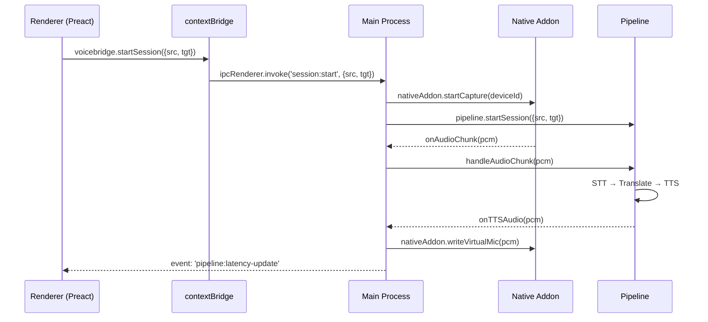
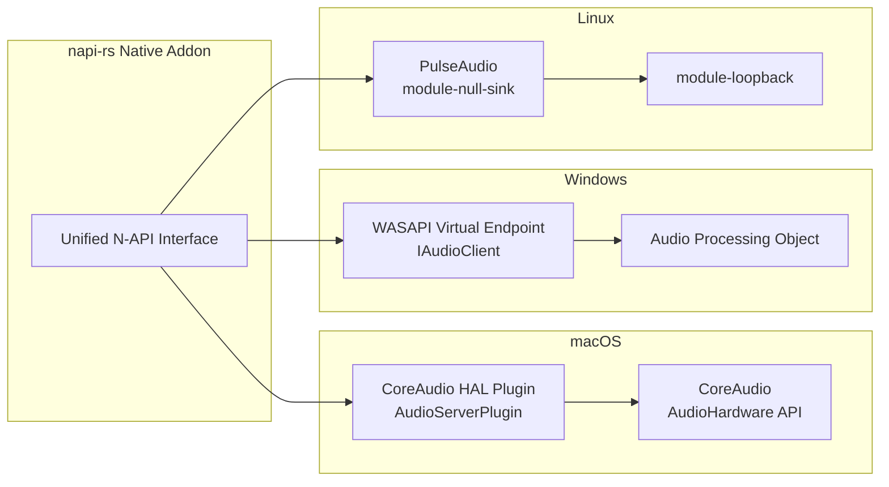
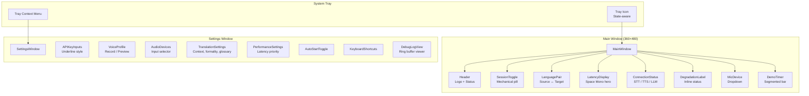
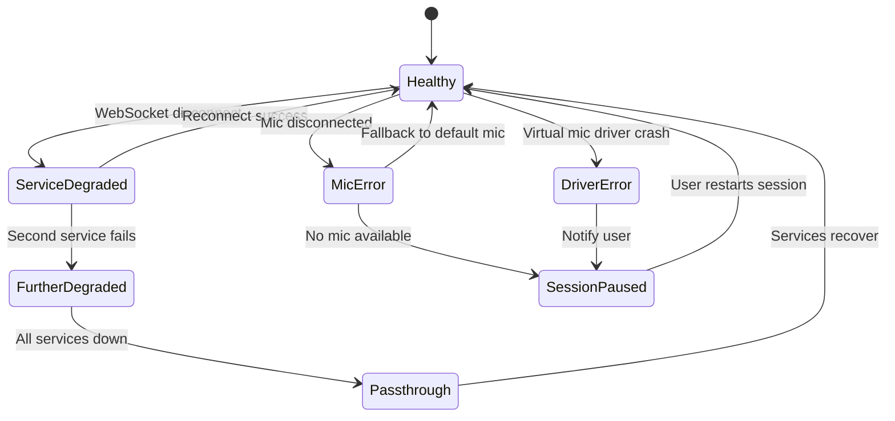

# Design Document: VoiceBridge Desktop App Rewrite

## Overview

VoiceBridge Desktop replaces the Chrome Extension with an Electron + Preact desktop application that installs an OS-level virtual microphone driver. Instead of injecting into browser tabs via content scripts and WebRTC track replacement, the desktop app creates a system-wide virtual audio device ("VoiceBridge Mic") that any application can select as its microphone input. The translation pipeline (STT → LLM → TTS) is reused wholesale from the existing codebase.

### Key Architectural Shift

```
Chrome Extension (current):
  Content Script → getUserMedia intercept → WebRTC replaceTrack → Meeting App

Desktop App (new):
  Native Addon → Real Mic Capture → Pipeline → Virtual Mic Driver → ANY App
```

The desktop app eliminates all meeting-platform-specific adapters, content script injection, offscreen documents, and the fragile audio bridge between extension contexts. The virtual mic driver operates at the OS audio layer, making it universally compatible.

### Module Reuse Summary

| Module | Status | Changes Required |
|--------|--------|-----------------|
| `PipelineOrchestrator` | **Reuse** | Replace `chrome.*` calls with Electron IPC; remove `sendMessage` chrome dependency |
| `STTClient` | **Reuse** | No changes — pure WebSocket client |
| `TranslationEngine` | **Reuse** | No changes — pure HTTP/fetch streaming |
| `TTSClient` | **Reuse** | No changes — pure WebSocket client |
| `EchoCancellationModule` | **Reuse** | No changes — pure state machine |
| `LatencyMonitor` | **Reuse** | No changes — pure timing logic |
| `DegradationManager` | **Reuse** | No changes — pure state computation |
| `CleanupSequencer` | **Reuse** | No changes — pure cleanup orchestration |
| `AudioCaptureModule` | **Replace** | New N-API-based capture instead of `getUserMedia` |
| `AudioOutputModule` | **Replace** | New N-API-based virtual mic writer instead of WebRTC destination |
| `VoiceProfileManager` | **Reuse** | Replace `MediaRecorder` with N-API recording; REST API calls unchanged |
| `SettingsStore` | **Replace** | Filesystem JSON + Node.js `crypto` instead of `chrome.storage` + Web Crypto |
| `MessageBus` | **Replace** | Electron IPC (`ipcMain`/`ipcRenderer`) instead of `chrome.runtime.sendMessage` |
| `DebugLog` | **Reuse** | Increase buffer to 500 entries; no structural changes |
| `AudioBridge` | **Remove** | No longer needed — direct N-API calls replace MessageChannel bridge |
| `MeetingDetector` | **Remove** | No longer needed — virtual mic works with any app |
| `PlatformAdapters` | **Remove** | No longer needed — no per-meeting-app injection |

## Architecture

### Process Model

```mermaid
graph TB
    subgraph "Electron Main Process"
        M[Main Process<br/>Node.js + N-API]
        IPC[IPC Router]
        NA[Native Addon<br/>napi-rs]
        SS[SettingsStore<br/>Filesystem + AES-GCM]
        DI[DriverInstaller]
        AT[AutoStart Manager]
    end

    subgraph "Electron Renderer Process"
        R[Preact UI<br/>Main Window]
        T[System Tray]
    end

    subgraph "OS Audio Layer"
        RM[Real Microphone]
        VM[Virtual Mic Driver<br/>"VoiceBridge Mic"]
        MA[Meeting App<br/>Zoom / Teams / etc.]
    end

    subgraph "Pipeline (Main Process)"
        PO[PipelineOrchestrator]
        STT[STTClient<br/>WebSocket]
        TE[TranslationEngine<br/>HTTP Stream]
        TTS[TTSClient<br/>WebSocket]
        EC[EchoCancellation]
        LM[LatencyMonitor]
        DM[DegradationManager]
    end

    R <-->|contextBridge IPC| IPC
    T <-->|Electron Tray API| M
    IPC <--> M
    M --> NA
    NA -->|Capture PCM 16kHz| RM
    NA -->|Write PCM 48kHz| VM
    VM -->|OS Audio Route| MA
    M --> SS
    M --> DI
    M --> AT
    PO --> STT
    PO --> TE
    PO --> TTS
    PO --> EC
    PO --> LM
    PO --> DM
    M --> PO
    NA -->|Audio chunks| PO
    PO -->|TTS audio| NA
```

### Security Boundary

The Electron renderer process runs with `contextIsolation: true` and `nodeIntegration: false`. All sensitive operations (API calls, encryption, native addon access, file I/O) happen exclusively in the main process. The renderer communicates via a typed `contextBridge` API that exposes only the methods needed for the UI.

```typescript
// SECURITY: Renderer has NO access to:
// - Node.js APIs (fs, crypto, child_process)
// - Native addon
// - API keys (never leave main process)
// - Raw IPC (only contextBridge-exposed methods)
```

### IPC Architecture



All IPC messages are validated against a typed schema. The main process rejects any message that doesn't match the expected shape.

## Components and Interfaces

### 1. Native Audio Addon (`native-addon`)

The N-API addon (built with `napi-rs` for Rust safety and cross-compilation) provides the bridge between Node.js and OS audio APIs.

```typescript
/** Native addon interface exposed to the main process */
interface NativeAudioAddon {
  // ── Device Enumeration ──
  enumerateInputDevices(): AudioDeviceInfo[];
  getDefaultInputDevice(): AudioDeviceInfo | null;

  // ── Real Mic Capture ──
  startCapture(deviceId: string, config: CaptureConfig): void;
  stopCapture(): void;
  setCaptureGain(gainDb: number): void;
  onAudioChunk: (callback: (pcm: Buffer, sequenceId: number) => void) => void;

  // ── Virtual Mic Driver ──
  isDriverInstalled(): boolean;
  getDriverVersion(): string | null;
  installDriver(): DriverInstallResult;
  uninstallDriver(): boolean;
  writeVirtualMic(pcm: Buffer): void;
  getDriverStatus(): DriverStatus;

  // ── Resampling ──
  resample(pcm: Buffer, fromRate: number, toRate: number): Buffer;
}

interface AudioDeviceInfo {
  id: string;
  name: string;
  sampleRate: number;
  channels: number;
  isDefault: boolean;
}

interface CaptureConfig {
  sampleRate: 16000;
  channels: 1;
  bufferSizeMs: 250;
  format: 'pcm_s16le';
}

interface DriverInstallResult {
  success: boolean;
  error?: string;
  osErrorCode?: number;
  requiresReboot?: boolean;
}

type DriverStatus =
  | { state: 'installed'; version: string; active: boolean; sampleRate: number }
  | { state: 'not-installed' }
  | { state: 'error'; error: string };
```

### Platform-Specific Driver Implementations



**macOS (CoreAudio HAL Plugin):**
- Registers as an `AudioServerPlugin` bundle in `/Library/Audio/Plug-Ins/HAL/`
- Creates a virtual audio device with 1 channel, 48kHz, Float32
- The plugin reads from a shared memory ring buffer that the N-API addon writes to
- Requires `sudo` for installation (copies plugin bundle to system directory)

**Windows (WASAPI Virtual Audio Endpoint):**
- Registers a virtual audio endpoint driver via Windows Audio Device Graph
- Creates a device named "VoiceBridge Mic" with 1 channel, 48kHz, PCM Int16
- Uses a named shared memory section for audio data transfer
- Requires administrator elevation for driver installation

**Linux (PulseAudio):**
- Creates a null sink via `pactl load-module module-null-sink sink_name=voicebridge_mic sink_properties=device.description="VoiceBridge Mic"`
- Configures `module-loopback` to route the sink's monitor to a virtual source
- No elevation required — PulseAudio modules are user-space
- Configuration persists via `~/.config/pulse/default.pa`

### 2. Audio Router (`audio-router.ts`) — NEW

Replaces the Chrome extension's `AudioCaptureModule` + `AudioOutputModule` + `AudioBridge` with a single unified module that coordinates real mic capture, pipeline routing, and virtual mic output.

```typescript
interface AudioRouterConfig {
  captureDeviceId: string | null; // null = OS default
  captureSampleRate: 16000;
  outputSampleRate: 48000;
  noiseGateThresholdDb: number;
  vadSpeechOnsetMs: number;
  vadSpeechOffsetMs: number;
  ghostModeEnabled: boolean;
}

interface AudioRouter {
  start(config: AudioRouterConfig): void;
  stop(): void;
  setPassthrough(enabled: boolean): void;
  setCaptureDevice(deviceId: string): void;
  setGhostMode(enabled: boolean): void;
  setNoiseGateThreshold(db: number): void;
  getInputLevel(): number;
  getAverageInputLevel(): number;

  // Callbacks wired to PipelineOrchestrator
  onAudioChunk: ((chunk: Buffer, sequenceId: number) => void) | null;
  onVADStateChange: ((state: VADState) => void) | null;
  onSpeechEnd: (() => void) | null;

  // Called by PipelineOrchestrator when TTS audio is ready
  writeTTSAudio(pcm: Buffer): void;
  writeSilence(): void;
  writePassthrough(pcm: Buffer): void;
  fadeOutTTS(durationMs: number): void;
}
```

The `AudioRouter` reuses the existing pure functions `computeRmsDb`, `transitionVADState`, `transitionRoutingState`, and `getAudioSource` from the current codebase. Only the I/O layer changes (N-API instead of Web Audio API).

### 3. Desktop Pipeline Orchestrator (`desktop-pipeline.ts`) — ADAPTED

Wraps the existing `PipelineOrchestrator` with Electron-specific wiring. The core orchestration logic (sequence tracking, backpressure, degradation cascade, stage timeouts) is reused unchanged.

```typescript
interface DesktopPipelineConfig extends PipelineOrchestratorConfig {
  // Desktop-specific additions
  virtualMicWriteLatencyMs: number;
  volumeNormalizationEnabled: boolean;
  referenceVolumeCalibrationMs: number;
}

/** Adapts PipelineOrchestrator for Electron main process */
class DesktopPipeline {
  #orchestrator: PipelineOrchestrator;
  #audioRouter: AudioRouter;
  #nativeAddon: NativeAudioAddon;
  #ipcEmitter: ElectronIPCEmitter;

  // Replaces chrome.runtime.sendMessage with Electron IPC
  // Replaces AudioCaptureModule with AudioRouter + NativeAddon
  // Replaces AudioOutputModule with NativeAddon.writeVirtualMic
}
```

### 4. Settings Store (`desktop-settings-store.ts`) — REPLACED

Replaces `chrome.storage` with filesystem-based JSON storage using Node.js `crypto` for AES-GCM-256 encryption.

```typescript
interface DesktopSettingsStore {
  get<K extends keyof SettingsSchema>(key: K): Promise<SettingsSchema[K]>;
  set<K extends keyof SettingsSchema>(key: K, value: SettingsSchema[K]): Promise<void>;
  getAll(): Promise<Partial<SettingsSchema>>;

  exportSettings(): Promise<string>;
  importSettings(json: string): Promise<void>;
  migrateFromVersion(oldVersion: string): Promise<void>;

  // Atomic writes: write to .tmp, then rename
  flush(): Promise<void>;
}
```

**Storage paths:**
- macOS: `~/Library/Application Support/VoiceBridge/settings.json`
- Windows: `%APPDATA%/VoiceBridge/settings.json`
- Linux: `~/.config/voicebridge/settings.json`

**Encryption:** API keys are encrypted with AES-GCM-256. The encryption key is derived via PBKDF2 (100,000 iterations, SHA-256) from a machine-specific identifier (`os.hostname() + os.userInfo().username`) combined with a per-install random salt stored alongside the settings file.

### 5. Electron IPC Message Bus (`electron-ipc.ts`) — REPLACED

Replaces `chrome.runtime.sendMessage` with Electron's typed IPC.

```typescript
/** Main process → Renderer events (one-way) */
interface MainToRendererEvents {
  'pipeline:latency-update': LatencyMeasurement;
  'pipeline:stage-update': { sequenceId: number; stage: PipelineStage };
  'pipeline:degradation-changed': { level: DegradationLevel; previous: DegradationLevel };
  'session:state-changed': SessionState;
  'connection:state-changed': { service: 'stt' | 'tts' | 'llm'; state: ServiceConnectionState };
  'audio:level': { rmsDb: number; vadState: VADState['status'] };
  'audio:driver-status': DriverStatus;
  'demo:time-update': { voiceTimeRemainingMs: number };
  'error': { code: string; message: string; userMessage: string };
}

/** Renderer → Main process invocations (request/response) */
interface RendererToMainInvocations {
  'session:start': [{ sourceLanguage: string; targetLanguage: string }, void];
  'session:stop': [{ reason: string }, void];
  'settings:get': [{ key: string }, unknown];
  'settings:set': [{ key: string; value: unknown }, void];
  'settings:export': [void, string];
  'settings:import': [string, void];
  'devices:list': [void, AudioDeviceInfo[]];
  'devices:select': [{ deviceId: string }, void];
  'driver:status': [void, DriverStatus];
  'driver:install': [void, DriverInstallResult];
  'driver:uninstall': [void, boolean];
  'voice:start-recording': [void, void];
  'voice:stop-recording': [void, Blob];
  'voice:upload': [void, string];
  'voice:delete': [{ voiceId: string }, void];
  'voice:preview': [{ voiceId: string; text: string; language: string }, ArrayBuffer];
  'languages:list': [void, Language[]];
  'debug:get-log': [void, DebugLogEntry[]];
}
```

### 6. contextBridge Preload API (`preload.ts`)

```typescript
/** Exposed to renderer via contextBridge.exposeInMainWorld('voicebridge', api) */
interface VoiceBridgeAPI {
  // Session
  startSession(params: { sourceLanguage: string; targetLanguage: string }): Promise<void>;
  stopSession(reason: string): Promise<void>;

  // Settings
  getSetting(key: string): Promise<unknown>;
  setSetting(key: string, value: unknown): Promise<void>;
  exportSettings(): Promise<string>;
  importSettings(json: string): Promise<void>;

  // Audio devices
  listDevices(): Promise<AudioDeviceInfo[]>;
  selectDevice(deviceId: string): Promise<void>;

  // Driver
  getDriverStatus(): Promise<DriverStatus>;
  installDriver(): Promise<DriverInstallResult>;

  // Voice profile
  startRecording(): Promise<void>;
  stopRecording(): Promise<Blob>;
  uploadVoice(): Promise<string>;
  deleteVoice(voiceId: string): Promise<void>;
  previewVoice(voiceId: string, text: string, language: string): Promise<ArrayBuffer>;

  // Languages
  listLanguages(): Promise<Language[]>;

  // Debug
  getDebugLog(): Promise<DebugLogEntry[]>;

  // Events (main → renderer)
  on(event: string, callback: (...args: unknown[]) => void): () => void;
}
```

### 7. Preact UI Components



The UI uses Preact (3KB gzipped) with the Nothing design system CSS tokens. No React, no Tailwind, no state management libraries — plain Preact with `useReducer` for local state and the `contextBridge` API for main process communication.

### 8. Driver Installer (`driver-installer.ts`) — NEW

```typescript
interface DriverInstaller {
  checkInstalled(): DriverStatus;
  install(): Promise<DriverInstallResult>;
  uninstall(): Promise<boolean>;
  checkVersionCompatibility(bundledVersion: string): boolean;
  verifyDevicePresent(): boolean;
}
```

On macOS and Windows, installation requires elevated privileges. The app uses `sudo-prompt` (macOS) or `electron-sudo` patterns to request elevation. On Linux, PulseAudio module loading is user-space and requires no elevation.

### 9. Auto-Start Manager (`auto-start.ts`) — NEW

```typescript
interface AutoStartManager {
  isEnabled(): Promise<boolean>;
  enable(): Promise<void>;
  disable(): Promise<void>;
}
```

Uses `app.setLoginItemSettings()` on macOS/Windows. On Linux, creates/removes a `.desktop` file in `~/.config/autostart/`.

## Data Models

### Settings Schema (Desktop)

The settings schema is largely reused from the Chrome extension, with these changes:

```typescript
interface DesktopSettingsSchema {
  // ── Encrypted (AES-GCM-256) ──
  elevenLabsApiKey: string;
  llmApiKey: string;

  // ── Plaintext JSON ──
  // Language
  sourceLanguage: string;
  targetLanguage: string;
  recentLanguages: string[];

  // LLM
  llmProvider: LLMProvider;
  openRouterModel: string;
  contextWindowSize: number;
  preserveTechnicalTerms: boolean;
  customGlossary: GlossaryEntry[];
  meetingContext: string;
  formalityLevel: 'formal' | 'informal';

  // Voice
  voiceProfileId: string;
  voiceStability: number;
  voiceSimilarityBoost: number;
  voiceStyle: number;

  // Audio
  selectedMicDeviceId: string | null;
  noiseGateThresholdDb: number;
  vadSensitivity: 'low' | 'medium' | 'high';
  ghostMode: boolean;

  // App
  autoStartEnabled: boolean;
  theme: 'dark' | 'light' | 'system';
  keyboardShortcuts: {
    toggleTranslation: string;
    ghostMode: string;
    panicStop: string;
  };

  // Demo
  demoMode: boolean;
  demoUsage: DemoUsageState;
  embeddedKeyExhausted: boolean;
  embeddedKeyLastChecked: number;

  // Internal
  installId: string;
  onboardingComplete: boolean;
  settingsSchemaVersion: number;
  driverVersion: string | null;

  // Cache
  languageCache: { stt: string[]; tts: string[]; cachedAt: number };
}
```

### Pipeline State (Reused)

The `PipelineUtterance`, `SessionState`, `LatencyMeasurement`, `EchoState`, `VADState`, `AudioRoutingState`, and `DegradationLevel` types are reused unchanged from `src/lib/types.ts`.

### IPC Message Schema

```typescript
/** Validated IPC message envelope */
interface IPCMessage<T extends string = string> {
  channel: T;
  payload: unknown;
  timestamp: number;
  nonce: string; // Unique per message, prevents replay
}
```

### Audio Buffer Format

```typescript
/** Audio data flowing through the pipeline */
interface AudioChunk {
  pcm: Buffer;           // Raw PCM data
  sampleRate: number;    // 16000 (capture) or 48000 (output)
  channels: 1;
  format: 'pcm_s16le' | 'pcm_f32le';
  sequenceId: number;
  timestamp: number;
}
```

### Driver Manifest

```typescript
/** Bundled with each platform build */
interface DriverManifest {
  version: string;
  platform: 'darwin' | 'win32' | 'linux';
  arch: 'x64' | 'arm64';
  driverBinaryPath: string;
  installScript: string;
  uninstallScript: string;
  checksum: string;
}
```


## Correctness Properties

*A property is a characteristic or behavior that should hold true across all valid executions of a system — essentially, a formal statement about what the system should do. Properties serve as the bridge between human-readable specifications and machine-verifiable correctness guarantees.*

### Property 1: Audio chunking produces fixed-size output

*For any* sequence of PCM Int16 audio samples of arbitrary length fed into the audio chunker, every emitted chunk SHALL be exactly 4000 samples (250ms at 16kHz), and the total number of samples across all emitted chunks SHALL equal the largest multiple of 4000 that is ≤ the total input sample count.

**Validates: Requirements 2.4**

### Property 2: TTS resampling preserves sample count ratio and value range

*For any* PCM Int16 buffer at 24kHz, resampling to 48kHz Float32 SHALL produce an output buffer with exactly 2× the input sample count, and every output sample SHALL be in the range [-1.0, 1.0].

**Validates: Requirements 2.5, 4.1**

### Property 3: Audio routing state machine transitions are deterministic and complete

*For any* valid `AudioRoutingState` and any `AudioRoutingEvent`, the `transitionRoutingState` function SHALL return a valid `AudioRoutingState`, and the `getAudioSource` function SHALL return the correct audio source: `'mic'` for PASSTHROUGH, `'silence'` for MUTED, `'tts'` for TTS_PLAYING, and `'mic-fade-tts'` for BARGE_IN.

**Validates: Requirements 2.6, 4.3, 4.4**

### Property 4: VAD state transitions follow onset/offset delay rules

*For any* sequence of energy levels (in dB) and timestamps, the `transitionVADState` function SHALL only transition from `silence` to `speech` after the energy has been above the threshold for at least `onsetDelayMs` consecutive milliseconds, and SHALL only transition from `speech` to `silence` after the energy has been below the threshold for at least `offsetDelayMs` consecutive milliseconds.

**Validates: Requirements 2.8**

### Property 5: Noise gate rejects sub-threshold audio

*For any* PCM Int16 audio frame, if `computeRmsDb(frame)` returns a value ≤ the configured noise gate threshold, the frame SHALL be rejected (not forwarded to STT). If the value is > the threshold, the frame SHALL pass through.

**Validates: Requirements 2.9**

### Property 6: Echo cancellation state machine preserves transition rules

*For any* sequence of `EchoEvent` values, the `transitionEchoState` function SHALL enforce: (1) from `listening`, only `tts_start` transitions to `speaking`; (2) from `speaking`, only `tts_end` transitions to `transitioning` and only `barge_in` transitions to `listening`; (3) from `transitioning`, only `transition_complete` or `barge_in` transitions to `listening`. The mic SHALL be muted in `speaking` and `transitioning` states only.

**Validates: Requirements 3.5**

### Property 7: Degradation level computation follows cascade rules

*For any* `ServiceHealth` state (with each service being connected, disconnected, connecting, or error), `computeDegradationLevel` SHALL return: `'full'` iff all three services are connected, `'text-only'` iff STT and LLM are connected but TTS is not, `'transcription-only'` iff only STT is connected, and `'passthrough'` iff STT is not connected.

**Validates: Requirements 3.7**

### Property 8: Backpressure queue never exceeds configured limits

*For any* sequence of utterance arrivals and completions, the pipeline SHALL never have more than `maxQueueSize` (3) utterances in CAPTURED or TRANSCRIBED state simultaneously, and SHALL never have more than `maxActiveUtterances` (10) utterances in the tracking map. Excess utterances SHALL be dropped with reason `'backpressure'`.

**Validates: Requirements 3.10**

### Property 9: Volume normalization scales TTS output to match reference level

*For any* reference RMS level measured from the real microphone and any TTS audio buffer, the normalized output RMS SHALL be within ±3dB of the reference level.

**Validates: Requirements 4.7**

### Property 10: Latency-to-color mapping follows threshold boundaries

*For any* latency value in milliseconds, the color mapping SHALL return `'green'` for values < 1500, `'yellow'` for values in [1500, 2500], and `'red'` for values > 2500.

**Validates: Requirements 5.6**

### Property 11: Language filtering excludes source and matches search query

*For any* source language code and search query string, the filtered target language list SHALL (1) never contain the selected source language, and (2) contain only languages whose name or code matches the search query (case-insensitive substring match).

**Validates: Requirements 5.5, 6.2**

### Property 12: Encryption round-trip preserves plaintext

*For any* non-empty string, encrypting with AES-GCM-256 (using PBKDF2-derived key from machine identifier + salt) and then decrypting SHALL produce the original string.

**Validates: Requirements 6.8, 10.3, 12.2**

### Property 13: Settings persistence round-trip

*For any* valid `DesktopSettingsSchema` object, writing all settings to the store and then reading them back SHALL produce an object equal to the original. Encrypted fields SHALL be stored as ciphertext on disk and decrypted transparently on read.

**Validates: Requirements 12.1, 12.3, 6.10**

### Property 14: Settings export never contains sensitive fields

*For any* settings state (including populated API keys), the `exportSettings` function SHALL produce a JSON string that does NOT contain the keys `elevenLabsApiKey` or `llmApiKey`, and SHALL contain all non-sensitive settings.

**Validates: Requirements 12.5**

### Property 15: Settings import validates schema and rejects invalid input

*For any* JSON string, `importSettings` SHALL accept it only if it conforms to the `DesktopSettingsSchema` (correct types for all present fields). Invalid JSON or mistyped fields SHALL cause the import to reject without modifying the current settings.

**Validates: Requirements 12.6**

### Property 16: Settings migration produces valid schema

*For any* settings object conforming to an older schema version, the migration function SHALL produce a valid object conforming to the current schema version, preserving all compatible field values and applying defaults for new fields.

**Validates: Requirements 12.10**

### Property 17: IPC message validation accepts well-formed and rejects malformed messages

*For any* IPC message object, the validator SHALL accept it if and only if it has a valid `channel` string matching a known channel name, a `payload` matching the expected type for that channel, a numeric `timestamp`, and a string `nonce`. All other shapes SHALL be rejected.

**Validates: Requirements 10.10**

### Property 18: Demo voice-time tracking enforces rolling window limit

*For any* sequence of VAD-active speech durations within a 24-hour rolling window, the cumulative voice time SHALL be correctly tracked, and the session SHALL be stopped when the cumulative time reaches 300,000ms (5 minutes). The window SHALL roll forward such that usage older than 24 hours is no longer counted.

**Validates: Requirements 11.3**

### Property 19: Debug log ring buffer never exceeds maximum size

*For any* number of log entries added (including numbers > 500), the debug log buffer size SHALL never exceed 500 entries. When the buffer is full, the oldest entry SHALL be evicted first (FIFO).

**Validates: Requirements 7.7**

### Property 20: Consecutive high-latency detection triggers at exact threshold

*For any* sequence of end-to-end latency measurements, the high-latency warning SHALL be emitted if and only if 5 or more consecutive measurements exceed 3000ms. The counter SHALL reset to 0 when a measurement ≤ 3000ms is observed.

**Validates: Requirements 7.4**

### Property 21: Platform mapping returns correct OS-specific values

*For any* platform identifier (`'darwin'`, `'win32'`, `'linux'`), the platform mapping functions SHALL return: (1) the correct config directory path, (2) the correct driver implementation class, and (3) keyboard shortcuts with `Cmd` substituted for `Ctrl` on `'darwin'` and `Ctrl` preserved on other platforms.

**Validates: Requirements 9.5, 9.10, 10.4**

## Error Handling

### Error Categories

| Category | Examples | Strategy |
|----------|----------|----------|
| Driver errors | Installation failure, driver crash, device disappearance | Display OS error code, offer retry, fall back to passthrough |
| Audio device errors | Mic disconnected, permission denied, format mismatch | Pause session, notify user, attempt fallback to default device |
| Pipeline service errors | WebSocket disconnect, API timeout, rate limiting | Reuse existing degradation cascade (full → text-only → transcription-only → passthrough) |
| Encryption errors | Corrupt settings file, key derivation failure | Reset to defaults, prompt for API key re-entry |
| IPC errors | Malformed message, renderer crash | Log and reject invalid messages; restart renderer if crashed |

### Error Recovery Flow



### Panic Stop (Ctrl/Cmd+Shift+X)

The panic stop executes a deterministic cleanup sequence reusing the existing `executeCleanupSequence`:

1. Stop audio capture (N-API `stopCapture`)
2. Disconnect STT WebSocket
3. Destroy translation engine
4. Disconnect TTS WebSocket
5. Write silence to virtual mic
6. Clear all in-memory transcripts and audio buffers
7. Clear latency monitor
8. Emit `session:state-changed` with `active: false`

Each step is try/catch wrapped — failures are logged but don't block subsequent steps.

## Testing Strategy

### Property-Based Tests (fast-check)

The project uses `fast-check` (already a devDependency) for property-based testing with `vitest` as the test runner.

**Configuration:**
- Minimum 100 iterations per property test
- Each test tagged with: `Feature: desktop-app-rewrite, Property {N}: {title}`
- Tests run via `vitest run` (not watch mode)

**Property tests cover:**
- Audio chunking invariant (Property 1)
- TTS resampling correctness (Property 2)
- Audio routing state machine (Property 3)
- VAD state transitions (Property 4)
- Noise gate filtering (Property 5)
- Echo cancellation state machine (Property 6)
- Degradation level computation (Property 7)
- Backpressure queue limits (Property 8)
- Volume normalization (Property 9)
- Latency color mapping (Property 10)
- Language filtering (Property 11)
- Encryption round-trip (Property 12)
- Settings persistence round-trip (Property 13)
- Settings export excludes secrets (Property 14)
- Settings import validation (Property 15)
- Settings migration (Property 16)
- IPC message validation (Property 17)
- Demo voice-time tracking (Property 18)
- Debug log ring buffer (Property 19)
- Consecutive high-latency detection (Property 20)
- Platform mapping (Property 21)

### Unit Tests (Example-Based)

- Driver version compatibility check (1.10)
- Driver installation error display (1.7)
- Default mic fallback when none selected (2.3)
- Ghost Mode threshold and gain values (2.10)
- Barge-in timing (4.5)
- Tray icon state mapping (5.2)
- Connection status indicator text (5.7)
- Degradation level display text (5.8)
- Default voice fallback (6.7)
- Cache TTL staleness (6.4)
- Auto-start default off (8.1)
- Transcript clearing on session end (10.2)
- Panic stop cleanup sequence (10.7)
- Demo mode activation logic (11.1, 11.2, 11.5, 11.6, 11.7)
- Settings change immediate effect (12.9)

### Integration Tests

- Driver installation/uninstallation per platform (1.2–1.6, 1.8, 1.9)
- Audio device enumeration (2.1, 2.2)
- Mic disconnection recovery (2.7)
- Virtual mic write latency benchmark (4.2)
- Passthrough latency benchmark (4.6)
- Driver failure detection timing (4.8)
- Auto-start registration per platform (8.2–8.4, 8.7)
- Settings file atomic write (12.7, 12.8)

### Smoke Tests

- Driver presence check on startup (1.1, 8.6)
- No audio files written to disk (10.1)
- No telemetry or tracking (10.5, 10.6)
- API keys not exposed to renderer (10.8)
- No plaintext demo keys in source (11.10)

### Test Organization

```
desktop/
├── src/
│   ├── main/           # Electron main process
│   ├── renderer/       # Preact UI
│   ├── native/         # N-API addon (Rust)
│   └── shared/         # Reused pipeline modules
└── tests/
    ├── properties/     # Property-based tests (fast-check)
    ├── unit/           # Example-based unit tests
    ├── integration/    # Platform-specific integration tests
    └── smoke/          # Smoke tests
```
