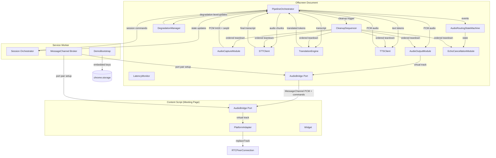
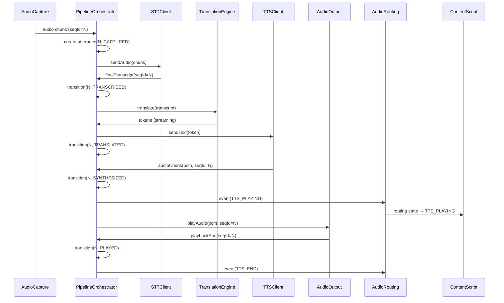
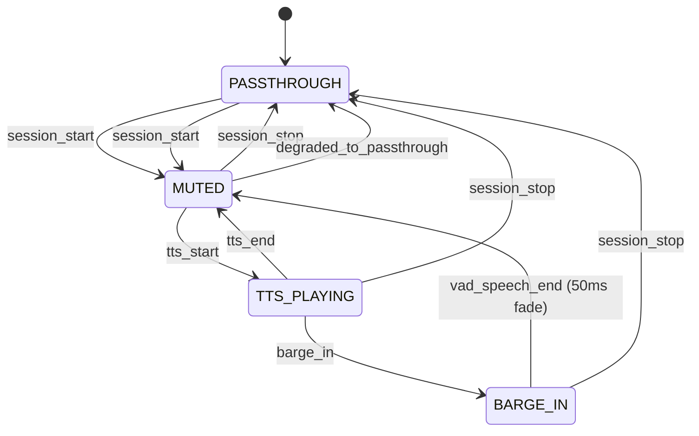

# Design Document: VoiceBridge Pipeline Hardening (Part 2)

## Overview

This design hardens the existing VoiceBridge modules into a production-quality real-time voice translation pipeline. The core problem: `offscreen.ts` currently wires modules together ad-hoc — no sequence tracking, no playback ordering, no backpressure, no failure isolation, no track replacement coordination, and no deterministic cleanup.

The hardening introduces seven new components:

1. **PipelineOrchestrator** — central state machine in the offscreen document that tracks every utterance through CAPTURED → TRANSCRIBED → TRANSLATED → SYNTHESIZED → PLAYED / DROPPED with monotonic sequence IDs, enforces strict playback ordering, manages backpressure, and coordinates degradation cascading.

2. **AudioRoutingStateMachine** — pure state machine governing what audio reaches the meeting: PASSTHROUGH / MUTED / TTS_PLAYING / BARGE_IN, coordinating with the existing EchoCancellationModule.

3. **PlatformAdapter interface + 5 concrete adapters** — Google Meet (getUserMedia intercept), Teams (RTCPeerConnection monitor), Discord (RTCPeerConnection monitor), Zoom (tabCapture mix), Generic (RTCPeerConnection monitor). Each handles track injection/restoration for its platform.

4. **AudioBridge** — MessageChannel-based port pair between offscreen document and content script for zero-copy audio transfer, bypassing the service worker.

5. **DegradationManager** — tracks service health and manages the cascade: full → text-only → transcription-only → passthrough, with automatic upgrade on recovery.

6. **DemoBootstrap** — auto-populates embedded API keys from Vite env vars into chrome.storage on first install.

7. **CleanupSequencer** — deterministic ordered teardown of all pipeline resources.

### What exists vs. what's new

| Component | Status | Changes |
|-----------|--------|---------|
| `AudioCaptureModule` | Exists | No changes — already emits chunks with sequence IDs |
| `STTClient` | Exists | No changes — already has reconnection + buffering |
| `TranslationEngine` | Exists | No changes — already streams tokens |
| `TTSClient` | Exists | No changes — already has reconnection |
| `AudioOutputModule` | Exists | Add `getMixedTrack()` method |
| `EchoCancellationModule` | Exists | No changes — already pure state machine |
| `LatencyMonitor` | Exists | No changes |
| `MeetingDetector` | Exists | No changes |
| `MessageBus` | Exists | Add new message types for audio bridge |
| `offscreen.ts` | Exists | **Rewrite** — replace ad-hoc wiring with PipelineOrchestrator |
| `content-script.ts` | Exists | **Rewrite** — add PlatformAdapter, AudioBridge, track management |
| `service-worker.ts` | Exists | Add MessageChannel setup, demo bootstrap |
| `PipelineOrchestrator` | **New** | `src/lib/pipeline-orchestrator.ts` |
| `AudioRoutingStateMachine` | **New** | `src/lib/audio-routing.ts` |
| `PlatformAdapter` | **New** | `src/lib/platform-adapters.ts` |
| `AudioBridge` | **New** | `src/lib/audio-bridge.ts` |
| `DegradationManager` | **New** | `src/lib/degradation-manager.ts` |
| `DemoBootstrap` | **New** | `src/lib/demo-bootstrap.ts` |
| `CleanupSequencer` | **New** | `src/lib/cleanup-sequencer.ts` |

## Architecture

### Data Flow Diagram



### Utterance Lifecycle Sequence




## Components and Interfaces

### 1. PipelineOrchestrator (`src/lib/pipeline-orchestrator.ts`)

The central coordinator. Replaces the ad-hoc wiring in `offscreen.ts`.

```typescript
// ── Audio Routing State Machine (embedded in orchestrator) ──

export type AudioRoutingState = 'PASSTHROUGH' | 'MUTED' | 'TTS_PLAYING' | 'BARGE_IN';

export type AudioRoutingEvent =
  | { type: 'session_start' }
  | { type: 'session_stop' }
  | { type: 'vad_speech_start' }
  | { type: 'vad_speech_end' }
  | { type: 'tts_start' }
  | { type: 'tts_end' }
  | { type: 'barge_in' }
  | { type: 'degraded_to_passthrough' };

/**
 * Pure state transition function for audio routing.
 * No side effects — returns the new state given current state and event.
 */
export function transitionRoutingState(
  current: AudioRoutingState,
  event: AudioRoutingEvent
): AudioRoutingState;

// ── Degradation Level ───────────────────────────────────────

export type DegradationLevel = 'full' | 'text-only' | 'transcription-only' | 'passthrough';

export interface DegradationTransition {
  from: DegradationLevel;
  to: DegradationLevel;
  trigger: string;
  timestamp: number;
}

// ── Pipeline Orchestrator ───────────────────────────────────

export interface PipelineOrchestratorConfig {
  maxQueueSize: 3;
  maxActiveUtterances: 10;
  utteranceEvictionAgeSec: 30;
  sttTimeoutMs: 5000;
  translationTimeoutMs: 3000;
  ttsTimeoutMs: 3000;
  latencyAlertThresholdMs: 3000;
  latencyAlertConsecutiveCount: 5;
  reconnectSecondChanceDelayMs: 30000;
}

export class PipelineOrchestrator {
  // ── Utterance tracking ──
  #utterances: Map<number, PipelineUtterance>;
  #currentSequenceId: number;
  #playbackHead: number; // seqId of next utterance to play

  // ── Module references ──
  #audioCapture: AudioCaptureModule | null;
  #sttClient: STTClient | null;
  #translationEngine: TranslationEngine | null;
  #ttsClient: TTSClient | null;
  #audioOutput: AudioOutputModule | null;
  #echoCancellation: EchoCancellationModule | null;
  #latencyMonitor: LatencyMonitor | null;

  // ── State machines ──
  #routingState: AudioRoutingState;
  #degradationLevel: DegradationLevel;

  // ── Timers ──
  #stageTimeouts: Map<number, ReturnType<typeof setTimeout>>;
  #consecutiveHighLatency: number;

  constructor(config?: Partial<PipelineOrchestratorConfig>);

  /** Start a new session — initializes all modules, resets state */
  async startSession(params: {
    sourceLanguage: string;
    targetLanguage: string;
  }): Promise<void>;

  /** Stop the current session — deterministic cleanup */
  async stopSession(reason: string): Promise<void>;

  /** Called by AudioCaptureModule when VAD detects speech end */
  handleSpeechEnd(): void;

  /** Called by STTClient on final transcript */
  handleFinalTranscript(sequenceId: number, text: string, language: string): void;

  /** Called by TranslationEngine as tokens stream */
  handleTranslationToken(sequenceId: number, token: string): void;

  /** Called by TranslationEngine when translation completes */
  handleTranslationComplete(sequenceId: number, fullText: string): void;

  /** Called by TTSClient when audio chunk arrives */
  handleTTSAudio(pcm: Int16Array, sequenceId: number): void;

  /** Called by AudioOutputModule when playback finishes */
  handlePlaybackEnd(sequenceId: number): void;

  /** Called by service health monitors */
  handleServiceStateChange(
    service: 'stt' | 'tts' | 'llm',
    state: ServiceConnectionState
  ): void;

  /** Get current routing state for the content script */
  getRoutingState(): AudioRoutingState;

  /** Get current degradation level */
  getDegradationLevel(): DegradationLevel;

  // ── Private ──

  /** Enforce backpressure — drop oldest unprocessed if queue > 3 */
  #enforceBackpressure(): void;

  /** Check if utterance N can start playback (N-1 must be PLAYED or DROPPED) */
  #canPlay(sequenceId: number): boolean;

  /** Try to advance the playback head */
  #advancePlayback(): void;

  /** Drop an utterance with reason */
  #dropUtterance(sequenceId: number, reason: string): void;

  /** Set a per-stage timeout for an utterance */
  #setStageTimeout(sequenceId: number, stage: string, timeoutMs: number): void;

  /** Evict completed utterances older than 30s */
  #evictCompletedUtterances(): void;

  /** Evaluate degradation cascade based on service health */
  #evaluateDegradation(): void;

  /** Attempt to upgrade degradation level when services recover */
  #attemptUpgrade(): void;

  /** Execute deterministic cleanup sequence */
  #executeCleanup(): Promise<void>;
}
```

### 2. AudioRoutingStateMachine (`src/lib/audio-routing.ts`)

Pure function — no side effects. The orchestrator calls this and applies side effects.



```typescript
/**
 * Pure audio routing state transition.
 * Maps to what audio the meeting hears:
 *   PASSTHROUGH → original mic
 *   MUTED → silence (mic captured for STT only)
 *   TTS_PLAYING → TTS audio
 *   BARGE_IN → original mic (TTS fading out)
 */
export function transitionRoutingState(
  current: AudioRoutingState,
  event: AudioRoutingEvent
): AudioRoutingState {
  switch (current) {
    case 'PASSTHROUGH':
      if (event.type === 'session_start') return 'MUTED';
      return current;

    case 'MUTED':
      if (event.type === 'tts_start') return 'TTS_PLAYING';
      if (event.type === 'session_stop') return 'PASSTHROUGH';
      if (event.type === 'degraded_to_passthrough') return 'PASSTHROUGH';
      return current;

    case 'TTS_PLAYING':
      if (event.type === 'tts_end') return 'MUTED';
      if (event.type === 'barge_in') return 'BARGE_IN';
      if (event.type === 'session_stop') return 'PASSTHROUGH';
      return current;

    case 'BARGE_IN':
      if (event.type === 'vad_speech_end') return 'MUTED';
      if (event.type === 'session_stop') return 'PASSTHROUGH';
      return current;
  }
}

/**
 * Determine what the meeting hears in a given routing state.
 */
export function getAudioSource(state: AudioRoutingState): 'mic' | 'silence' | 'tts' | 'mic-fade-tts' {
  switch (state) {
    case 'PASSTHROUGH': return 'mic';
    case 'MUTED': return 'silence';
    case 'TTS_PLAYING': return 'tts';
    case 'BARGE_IN': return 'mic-fade-tts';
  }
}

/**
 * Map routing state to echo cancellation coordination.
 * MUTED + TTS_PLAYING → echo cancellation SPEAKING
 * PASSTHROUGH + BARGE_IN → echo cancellation LISTENING
 */
export function getEchoCancellationMode(state: AudioRoutingState): 'listening' | 'speaking' {
  switch (state) {
    case 'PASSTHROUGH':
    case 'BARGE_IN':
      return 'listening';
    case 'MUTED':
    case 'TTS_PLAYING':
      return 'speaking';
  }
}
```

### 3. PlatformAdapter Interface + Implementations (`src/lib/platform-adapters.ts`)

```typescript
/**
 * Platform-specific audio injection adapter.
 * Each adapter knows how to inject a virtual audio track into
 * the meeting platform's WebRTC peer connection.
 */
export interface PlatformAdapter {
  /** Platform identifier */
  readonly platform: MeetingPlatform;

  /** Initialize the adapter — inject main-world scripts, set up monitors */
  initialize(): Promise<void>;

  /** Replace the meeting's mic track with the virtual track */
  injectVirtualTrack(track: MediaStreamTrack): Promise<void>;

  /** Restore the original microphone track */
  restoreOriginalTrack(): Promise<void>;

  /** Check if the virtual track is currently injected */
  isInjected(): boolean;

  /** Clean up all injected scripts, listeners, and references */
  destroy(): void;
}

// ── Google Meet Adapter ─────────────────────────────────────

/**
 * Intercepts navigator.mediaDevices.getUserMedia at document_start.
 * Stores original audio track, replaces on session start.
 *
 * Injection strategy: main-world script via <script> element that
 * wraps getUserMedia before the page loads.
 */
export class GoogleMeetAdapter implements PlatformAdapter {
  readonly platform = 'google-meet' as const;
  #originalTrack: MediaStreamTrack | null;
  #injectedScript: HTMLScriptElement | null;
  #injected: boolean;

  async initialize(): Promise<void>;
  async injectVirtualTrack(track: MediaStreamTrack): Promise<void>;
  async restoreOriginalTrack(): Promise<void>;
  isInjected(): boolean;
  destroy(): void;
}

// ── Teams Adapter ───────────────────────────────────────────

/**
 * Monitors RTCPeerConnection constructor in main world.
 * Captures peer connections, uses replaceTrack() on audio sender.
 */
export class TeamsAdapter implements PlatformAdapter {
  readonly platform = 'teams' as const;
  #peerConnections: Set<RTCPeerConnection>;
  #originalTrack: MediaStreamTrack | null;
  #injected: boolean;

  async initialize(): Promise<void>;
  async injectVirtualTrack(track: MediaStreamTrack): Promise<void>;
  async restoreOriginalTrack(): Promise<void>;
  isInjected(): boolean;
  destroy(): void;
}

// ── Discord Adapter ─────────────────────────────────────────

/**
 * Same strategy as Teams — monitor RTCPeerConnection constructor,
 * capture connections, replaceTrack() on audio sender.
 */
export class DiscordAdapter implements PlatformAdapter {
  readonly platform = 'discord' as const;
  // Same shape as TeamsAdapter
}

// ── Zoom Adapter ────────────────────────────────────────────

/**
 * Zoom Web uses a custom media stack. Falls back to tabCapture mixing.
 * Uses chrome.tabCapture.capture() to get tab audio, creates an
 * AudioContext mixing node that combines TTS with tab output.
 */
export class ZoomAdapter implements PlatformAdapter {
  readonly platform = 'zoom' as const;
  #tabCaptureStream: MediaStream | null;
  #mixingContext: AudioContext | null;
  #mixingDestination: MediaStreamAudioDestinationNode | null;

  async initialize(): Promise<void>;
  async injectVirtualTrack(track: MediaStreamTrack): Promise<void>;
  async restoreOriginalTrack(): Promise<void>;
  isInjected(): boolean;
  destroy(): void;
}

// ── Generic WebRTC Adapter ──────────────────────────────────

/**
 * For "Force Enable" mode on unknown WebRTC apps.
 * Monitors RTCPeerConnection constructor, attempts replaceTrack()
 * on any detected audio sender.
 */
export class GenericAdapter implements PlatformAdapter {
  readonly platform = 'generic' as const;
  // Same shape as TeamsAdapter
}

// ── Factory ─────────────────────────────────────────────────

/**
 * Create the appropriate PlatformAdapter for the detected platform.
 */
export function createPlatformAdapter(platform: MeetingPlatform): PlatformAdapter | null {
  switch (platform) {
    case 'google-meet': return new GoogleMeetAdapter();
    case 'teams': return new TeamsAdapter();
    case 'discord': return new DiscordAdapter();
    case 'zoom': return new ZoomAdapter();
    case 'generic': return new GenericAdapter();
    case 'none': return null;
  }
}
```

### 4. AudioBridge (`src/lib/audio-bridge.ts`)

```typescript
/**
 * MessageChannel-based audio bridge between offscreen document
 * and content script. Bypasses the service worker for low-latency
 * audio data transfer using Transferable ArrayBuffers.
 */

// ── Message Types ───────────────────────────────────────────

export type AudioBridgeMessage =
  | { type: 'audio-chunk'; pcm: ArrayBuffer; sequenceId: number }
  | { type: 'track-command'; command: 'inject' | 'restore' | 'status' }
  | { type: 'track-response'; success: boolean; error?: string }
  | { type: 'state-sync'; routingState: AudioRoutingState; echoState: EchoState };

// ── Offscreen Side ──────────────────────────────────────────

export class AudioBridgeSender {
  #port: MessagePort | null;

  constructor();

  /** Attach the MessagePort (provided by service worker) */
  attachPort(port: MessagePort): void;

  /** Send a PCM audio chunk as Transferable (zero-copy) */
  sendAudioChunk(pcm: ArrayBuffer, sequenceId: number): void;

  /** Send a track injection/restoration command */
  sendTrackCommand(command: 'inject' | 'restore' | 'status'): Promise<boolean>;

  /** Sync routing and echo state to content script */
  syncState(routingState: AudioRoutingState, echoState: EchoState): void;

  /** Check if the port is connected */
  isConnected(): boolean;

  /** Close the port */
  close(): void;
}

// ── Content Script Side ─────────────────────────────────────

export class AudioBridgeReceiver {
  #port: MessagePort | null;

  onAudioChunk: ((pcm: ArrayBuffer, sequenceId: number) => void) | null;
  onTrackCommand: ((command: 'inject' | 'restore' | 'status') => void) | null;
  onStateSync: ((routingState: AudioRoutingState, echoState: EchoState) => void) | null;

  constructor();

  /** Attach the MessagePort (provided by service worker) */
  attachPort(port: MessagePort): void;

  /** Send a track command response back to offscreen */
  sendTrackResponse(success: boolean, error?: string): void;

  /** Check if the port is connected */
  isConnected(): boolean;

  /** Close the port */
  close(): void;
}
```

### 5. DegradationManager (`src/lib/degradation-manager.ts`)

```typescript
/**
 * Manages the degradation cascade based on service health.
 * Pure logic — the PipelineOrchestrator applies side effects.
 */

export interface ServiceHealth {
  stt: ServiceConnectionState;
  tts: ServiceConnectionState;
  llm: ServiceConnectionState;
}

/**
 * Determine the highest available degradation level given service health.
 *
 * full:               STT ✓  LLM ✓  TTS ✓
 * text-only:          STT ✓  LLM ✓  TTS ✗
 * transcription-only: STT ✓  LLM ✗  TTS ✗
 * passthrough:        STT ✗  LLM ✗  TTS ✗
 */
export function computeDegradationLevel(health: ServiceHealth): DegradationLevel;

/**
 * Check if a transition from `current` to `target` is valid.
 * Degradation must follow cascade order. Upgrade can skip levels.
 */
export function isValidDegradation(current: DegradationLevel, target: DegradationLevel): boolean;

/**
 * Get the next degradation level in the cascade (downgrade).
 */
export function getNextDegradationLevel(current: DegradationLevel): DegradationLevel | null;
```

### 6. DemoBootstrap (`src/lib/demo-bootstrap.ts`)

```typescript
/**
 * Auto-populate embedded API keys from Vite build-time env vars
 * into chrome.storage on first install.
 */

export interface DemoKeyConfig {
  elevenLabsKey: string;
  llmKey: string;
  llmProvider: LLMProvider;
  openRouterModel: string;
}

/**
 * Check for embedded demo keys and populate storage if needed.
 * Called by the service worker on first install.
 *
 * Returns true if demo keys were populated, false if user keys exist
 * or no embedded keys are available.
 */
export async function bootstrapDemoKeys(): Promise<boolean>;

/**
 * Check if the embedded ElevenLabs key is exhausted.
 * Caches the result for 6 hours to avoid repeated API calls.
 */
export async function checkEmbeddedKeyExhaustion(): Promise<boolean>;

/**
 * Check if demo keys are currently active (no user-provided keys).
 */
export async function isDemoMode(): Promise<boolean>;
```

### 7. CleanupSequencer (`src/lib/cleanup-sequencer.ts`)

```typescript
/**
 * Deterministic ordered cleanup of all pipeline resources.
 * Each step is try/catch wrapped — failures are logged but don't
 * block subsequent steps.
 */

export interface CleanupTarget {
  name: string;
  cleanup: () => Promise<void> | void;
}

/**
 * Execute cleanup in deterministic order.
 * Returns an array of any errors that occurred (empty = clean shutdown).
 */
export async function executeCleanupSequence(
  targets: CleanupTarget[]
): Promise<Array<{ name: string; error: Error }>>;

/**
 * Build the standard pipeline cleanup target list.
 * Order: AudioCapture → STT → Translation → TTS → AudioOutput → EchoCancellation → LatencyMonitor
 */
export function buildPipelineCleanupTargets(modules: {
  audioCapture: AudioCaptureModule | null;
  sttClient: STTClient | null;
  translationEngine: TranslationEngine | null;
  ttsClient: TTSClient | null;
  audioOutput: AudioOutputModule | null;
  echoCancellation: EchoCancellationModule | null;
  latencyMonitor: LatencyMonitor | null;
}): CleanupTarget[];
```

### 8. AudioOutputModule Extension

The existing `AudioOutputModule` needs one new method:

```typescript
// Added to existing AudioOutputModule class

/**
 * Get a MediaStreamTrack that dynamically switches between
 * silence and TTS audio based on the routing state.
 * This is the track injected into the meeting's RTCPeerConnection.
 *
 * Unlike getVirtualTrack() which returns the raw destination track,
 * getMixedTrack() returns a track from a mixing node that can
 * crossfade between silence and TTS output.
 */
getMixedTrack(): MediaStreamTrack | null;
```

### 9. Content Script Rewrite

The content script gains:
- PlatformAdapter lifecycle management
- AudioBridgeReceiver for MessageChannel audio
- RTCPeerConnection monitoring for renegotiation detection
- `beforeunload` handler for tab-close cleanup
- `window.postMessage` bridge with `voicebridge` source marker

### 10. Service Worker Additions

The service worker gains:
- MessageChannel broker: creates port pairs, sends one to offscreen, one to content script
- DemoBootstrap call on `runtime.onInstalled`
- Port disconnection detection and re-establishment


## Data Models

### Utterance Tracking

The `PipelineUtterance` type already exists in `src/lib/types.ts`. No changes needed — it already has `sequenceId`, `state` (PipelineStage), `capturedAt`, `transcript`, `translation`, `audioChunks`, `droppedReason`, and `latency`.

### New Types to Add to `src/lib/types.ts`

```typescript
// ── Audio Routing Types ─────────────────────────────────────

export type AudioRoutingState = 'PASSTHROUGH' | 'MUTED' | 'TTS_PLAYING' | 'BARGE_IN';

export type AudioRoutingEvent =
  | { type: 'session_start' }
  | { type: 'session_stop' }
  | { type: 'vad_speech_start' }
  | { type: 'vad_speech_end' }
  | { type: 'tts_start' }
  | { type: 'tts_end' }
  | { type: 'barge_in' }
  | { type: 'degraded_to_passthrough' };

// ── Degradation Types ───────────────────────────────────────

export type DegradationLevel = 'full' | 'text-only' | 'transcription-only' | 'passthrough';

export interface DegradationTransition {
  from: DegradationLevel;
  to: DegradationLevel;
  trigger: string;
  timestamp: number;
}

// ── Audio Bridge Types ──────────────────────────────────────

export type AudioBridgeMessage =
  | { type: 'audio-chunk'; pcm: ArrayBuffer; sequenceId: number }
  | { type: 'track-command'; command: 'inject' | 'restore' | 'status' }
  | { type: 'track-response'; success: boolean; error?: string }
  | { type: 'state-sync'; routingState: AudioRoutingState; echoState: EchoState };

// ── Cleanup Types ───────────────────────────────────────────

export interface CleanupTarget {
  name: string;
  cleanup: () => Promise<void> | void;
}

export interface CleanupResult {
  success: boolean;
  errors: Array<{ name: string; error: Error }>;
  durationMs: number;
}
```

### New Message Types for MessageBus

Add to `MessagePayloadMap` in `src/lib/message-bus.ts`:

```typescript
// New message types for pipeline hardening
AUDIO_ROUTING_STATE_CHANGED: { state: AudioRoutingState };
DEGRADATION_LEVEL_CHANGED: { level: DegradationLevel; previous: DegradationLevel; trigger: string };
UTTERANCE_STATE_CHANGED: { sequenceId: number; state: PipelineStage; reason?: string };
TRACK_INJECT: { tabId: number };
TRACK_RESTORE: { tabId: number };
TRACK_STATUS: { injected: boolean; platform: MeetingPlatform };
AUDIO_BRIDGE_READY: { tabId: number };
AUDIO_BRIDGE_DISCONNECTED: { tabId: number };
DEMO_KEYS_POPULATED: { provider: LLMProvider };
EMBEDDED_KEY_EXHAUSTED: undefined;
CLEANUP_COMPLETE: { errors: Array<{ name: string; message: string }> };
```

### State Persistence

| Data | Storage | Lifecycle |
|------|---------|-----------|
| Utterance map | In-memory (offscreen) | Per-session, cleared on stop |
| Routing state | In-memory (offscreen) | Per-session |
| Degradation level | `chrome.storage.session` | Survives SW restart |
| Demo key exhaustion | `chrome.storage.local` | Persistent, 6h cache |
| MessageChannel ports | In-memory (SW + offscreen + CS) | Per-tab, re-established on disconnect |
| Platform adapter state | In-memory (content script) | Per-tab |


## Correctness Properties

*A property is a characteristic or behavior that should hold true across all valid executions of a system — essentially, a formal statement about what the system should do. Properties serve as the bridge between human-readable specifications and machine-verifiable correctness guarantees.*

### Property 1: Utterance lifecycle follows valid state transitions

*For any* utterance created by the PipelineOrchestrator, its state transitions SHALL only follow the valid lifecycle path: CAPTURED → TRANSCRIBED → TRANSLATED → SYNTHESIZED → PLAYED, or transition to DROPPED from any intermediate state. No other transitions are permitted.

**Validates: Requirements 1.1, 1.3, 1.4, 1.5, 1.6**

### Property 2: Sequence IDs are monotonically increasing

*For any* session with N speech-end events, the assigned sequence IDs SHALL be exactly 1, 2, 3, ..., N with no gaps, no duplicates, and no out-of-order assignments. After a session reset, the counter restarts at 0.

**Validates: Requirements 1.2, 1.12**

### Property 3: Strict playback ordering

*For any* pair of utterances with sequence IDs N and N+1, utterance N+1 SHALL NOT begin playback (transition to SYNTHESIZED with audio routed to output) until utterance N has reached PLAYED or DROPPED state.

**Validates: Requirements 1.7**

### Property 4: Backpressure bounds the unprocessed queue

*For any* number of incoming utterances, the count of utterances in CAPTURED or TRANSCRIBED state SHALL never exceed 3. When the limit is exceeded, the oldest unprocessed utterances are dropped first (FIFO eviction).

**Validates: Requirements 1.8**

### Property 5: Failure isolation — failed utterances do not block the pipeline

*For any* utterance that fails at any stage (STT timeout, translation error, TTS failure, or stage timeout), the utterance SHALL transition to DROPPED with a reason string, and all subsequent utterances SHALL continue processing without being blocked.

**Validates: Requirements 1.9, 9.3**

### Property 6: Active utterance map is bounded

*For any* sequence of utterance lifecycle events, the PipelineOrchestrator's active utterance map SHALL never contain more than 10 entries. Completed utterances (PLAYED or DROPPED) older than 30 seconds are evicted.

**Validates: Requirements 1.11**

### Property 7: Audio routing state machine produces only valid transitions

*For any* sequence of AudioRoutingEvents applied to the routing state machine starting from PASSTHROUGH, the resulting state SHALL always be one of {PASSTHROUGH, MUTED, TTS_PLAYING, BARGE_IN}, and the transition function SHALL be deterministic — the same (state, event) pair always produces the same next state. Additionally, `getAudioSource()` SHALL map each state to the correct audio source: PASSTHROUGH→mic, MUTED→silence, TTS_PLAYING→tts, BARGE_IN→mic-fade-tts.

**Validates: Requirements 8.1, 8.2, 8.3, 8.4, 8.5, 2.3, 2.4, 2.10**

### Property 8: Routing state correctly maps to echo cancellation mode

*For any* AudioRoutingState, the `getEchoCancellationMode()` function SHALL return 'speaking' for MUTED and TTS_PLAYING states, and 'listening' for PASSTHROUGH and BARGE_IN states.

**Validates: Requirements 8.8**

### Property 9: Degradation level is correctly computed from service health

*For any* combination of service connection states (STT, TTS, LLM each being connected or not), `computeDegradationLevel()` SHALL return: `full` when all three are connected, `text-only` when STT and LLM are connected but TTS is not, `transcription-only` when only STT is connected, and `passthrough` when STT is not connected.

**Validates: Requirements 5.1, 5.2, 5.3, 5.4**

### Property 10: Degradation cascade never skips levels

*For any* sequence of service failures applied to the PipelineOrchestrator, the degradation level SHALL only step down one level at a time: full → text-only → transcription-only → passthrough. Direct transitions that skip levels (e.g., full → passthrough) SHALL never occur.

**Validates: Requirements 5.10**

### Property 11: Exponential backoff follows the formula

*For any* reconnection attempt number N (0-indexed), the calculated backoff delay SHALL equal min(500 × 2^N, 10000) milliseconds. The delay is always between 500ms and 10000ms inclusive.

**Validates: Requirements 4.4**

### Property 12: STT audio buffer respects the 10-second bound

*For any* amount of audio sent to the STTClient while disconnected, the internal buffer SHALL never hold more than 10 seconds of audio (160,000 PCM Int16 samples at 16kHz). Oldest samples are evicted when the buffer is full.

**Validates: Requirements 4.1**

### Property 13: Platform adapter factory returns correct adapter type

*For any* MeetingPlatform value, `createPlatformAdapter()` SHALL return an adapter whose `platform` property matches the input, or null for 'none'. The mapping is: google-meet→GoogleMeetAdapter, teams→TeamsAdapter, discord→DiscordAdapter, zoom→ZoomAdapter, generic→GenericAdapter.

**Validates: Requirements 3.7**

### Property 14: Cleanup resilience — all steps execute regardless of failures

*For any* list of CleanupTargets where an arbitrary subset throw errors, `executeCleanupSequence()` SHALL attempt every target in the list and return an array of errors from the failed targets. The count of attempted cleanups SHALL equal the total number of targets.

**Validates: Requirements 7.8, 7.10**

### Property 15: Cleanup executes in deterministic order

*For any* set of pipeline modules passed to `buildPipelineCleanupTargets()`, the returned target list SHALL always follow the order: AudioCapture → STT → Translation → TTS → AudioOutput → EchoCancellation → LatencyMonitor. Null modules are skipped but the relative order of non-null modules is preserved.

**Validates: Requirements 7.1**


## Error Handling

### Error Classification

Errors are classified by domain and severity, using the existing `DomainError` and `ErrorSeverity` types:

| Error | Domain | Severity | Recovery |
|-------|--------|----------|----------|
| STT WebSocket drop | `stt` / `connection-failed` | `recoverable` | Exponential backoff reconnection, buffer audio |
| STT token expired | `stt` / `token-expired` | `recoverable` | Acquire new token, reconnect |
| STT quota exceeded | `stt` / `quota-exceeded` | `degraded` | Degrade to passthrough |
| TTS WebSocket drop | `tts` / `connection-failed` | `recoverable` | Exponential backoff reconnection, buffer text |
| TTS voice not found | `tts` / `voice-not-found` | `degraded` | Degrade to text-only |
| TTS quota exhausted (402) | `tts` / `quota-exceeded` | `degraded` | Degrade to text-only, flag embedded key |
| LLM connection failed | `llm` / `connection-failed` | `recoverable` | Retry with backoff |
| LLM rate limited | `llm` / `rate-limited` | `recoverable` | Respect Retry-After header |
| LLM timeout (3 consecutive) | `llm` / `timeout` | `degraded` | Degrade to transcription-only |
| Mic denied | `audio` / `mic-denied` | `fatal` | Cannot proceed — prompt user |
| Mic disconnected | `audio` / `mic-disconnected` | `fatal` | Stop session, prompt reconnect |
| Track replace failed | `meeting` / `track-replace-failed` | `degraded` | Fall back to platform alternative |
| Injection failed | `meeting` / `injection-failed` | `degraded` | Display error in widget |
| Stage timeout (STT 5s) | `stt` / `connection-failed` | `recoverable` | Drop utterance, continue pipeline |
| Stage timeout (Translation 3s) | `llm` / `timeout` | `recoverable` | Drop utterance, continue pipeline |
| Stage timeout (TTS 3s) | `tts` / `connection-failed` | `recoverable` | Drop utterance, continue pipeline |
| Embedded key exhausted | `quota` / `embedded-key-exhausted` | `degraded` | Disable demo, prompt BYO key |
| Cleanup step failure | any | `recoverable` | Log error, continue remaining steps |

### Error Propagation Strategy

1. **Stage-level errors** (STT/Translation/TTS timeout or failure for a single utterance): Drop the utterance with reason, log to debug buffer, continue pipeline. No user notification unless consecutive failures exceed threshold.

2. **Service-level errors** (WebSocket disconnection, quota exhaustion): Trigger degradation cascade. Notify user via widget status text and CONNECTION_STATE_CHANGED message.

3. **Fatal errors** (mic denied, mic disconnected): Stop session immediately, execute cleanup, notify user with actionable error message.

4. **Cleanup errors**: Log and continue. Never throw from cleanup — use the `CleanupResult` type to report partial failures.

### Retry Strategy

| Service | Max Attempts | Base Delay | Max Delay | Second Chance |
|---------|-------------|------------|-----------|---------------|
| STT WebSocket | 5 | 500ms | 10s | 30s then 5 more |
| TTS WebSocket | 5 | 500ms | 10s | 30s then 5 more |
| LLM HTTP | 3 | 1s | 5s | Respect Retry-After |
| MessageChannel | 3 | 500ms | 2s | Re-establish on disconnect |

## Testing Strategy

### Property-Based Tests (fast-check)

Each correctness property maps to a property-based test with minimum 100 iterations. Tests use `fast-check` (already in devDependencies).

| Property | Test File | What's Generated |
|----------|-----------|-----------------|
| P1: Lifecycle transitions | `pipeline-orchestrator.property.test.ts` | Random sequences of pipeline events |
| P2: Monotonic sequence IDs | `pipeline-orchestrator.property.test.ts` | Random counts of speech-end events |
| P3: Playback ordering | `pipeline-orchestrator.property.test.ts` | Random interleaved completion events |
| P4: Backpressure | `pipeline-orchestrator.property.test.ts` | Random bursts of utterances |
| P5: Failure isolation | `pipeline-orchestrator.property.test.ts` | Random failure points in pipeline |
| P6: Bounded map | `pipeline-orchestrator.property.test.ts` | Random utterance lifecycles over time |
| P7: Routing state machine | `audio-routing.property.test.ts` | Random (state, event) pairs |
| P8: Routing→echo mapping | `audio-routing.property.test.ts` | Random routing states |
| P9: Degradation computation | `degradation-manager.property.test.ts` | Random service health combinations |
| P10: Cascade ordering | `degradation-manager.property.test.ts` | Random service failure sequences |
| P11: Backoff formula | `stt-client.property.test.ts` | Random attempt numbers |
| P12: STT buffer bound | `stt-client.property.test.ts` | Random audio chunk sizes during disconnect |
| P13: Adapter factory | `platform-adapters.property.test.ts` | Random platform values |
| P14: Cleanup resilience | `cleanup-sequencer.property.test.ts` | Random failure patterns |
| P15: Cleanup order | `cleanup-sequencer.property.test.ts` | Random module availability |

**Tag format:** `Feature: pipeline-hardening, Property {N}: {title}`

### Unit Tests (vitest)

Example-based tests for specific scenarios:

- Session start/stop lifecycle
- Demo key population with mocked chrome.storage
- Onboarding step skip when demo keys active
- Embedded key exhaustion (HTTP 402 mock)
- Widget status text for each degradation level
- MessageChannel port setup and teardown
- Track command acknowledgment protocol
- Consecutive high-latency alert (5 utterances > 3000ms)
- Translation flush on backpressure (queue ≥ 2)
- `beforeunload` handler sends SESSION_STOP

### Integration Tests

- Full pipeline flow: audio chunk → STT → Translation → TTS → playback (mocked WebSockets)
- WebSocket reconnection with audio buffer replay
- Platform adapter initialization with mocked DOM
- MessageChannel audio transfer with Transferable verification
- Degradation cascade with simulated service failures and recovery

### Test Configuration

```typescript
// vitest.config.ts — property test settings
export default defineConfig({
  test: {
    // Property tests need more time due to 100+ iterations
    testTimeout: 30000,
    // Colocate tests with source
    include: ['src/**/*.test.ts', 'src/**/*.property.test.ts'],
  },
});
```

