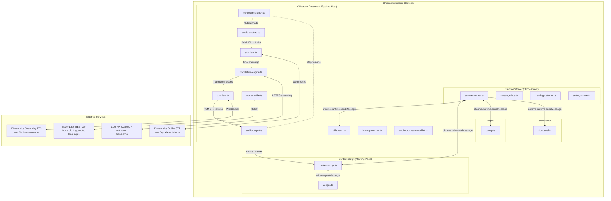
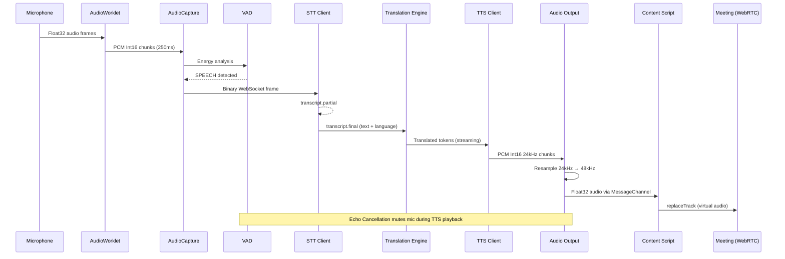
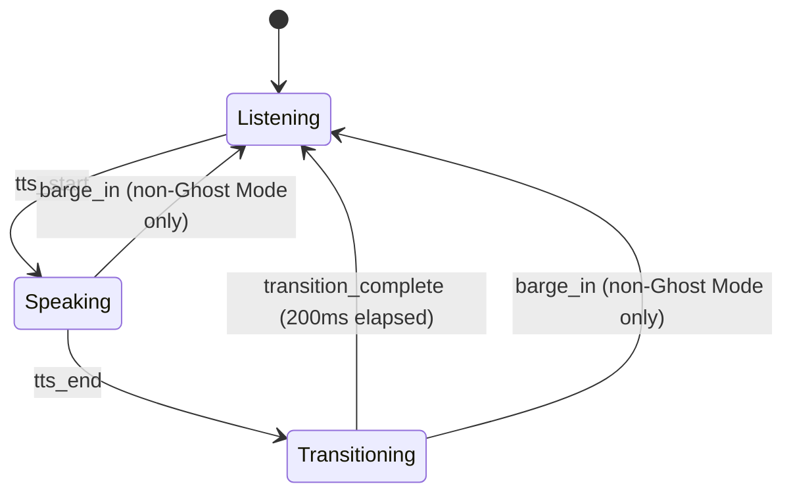
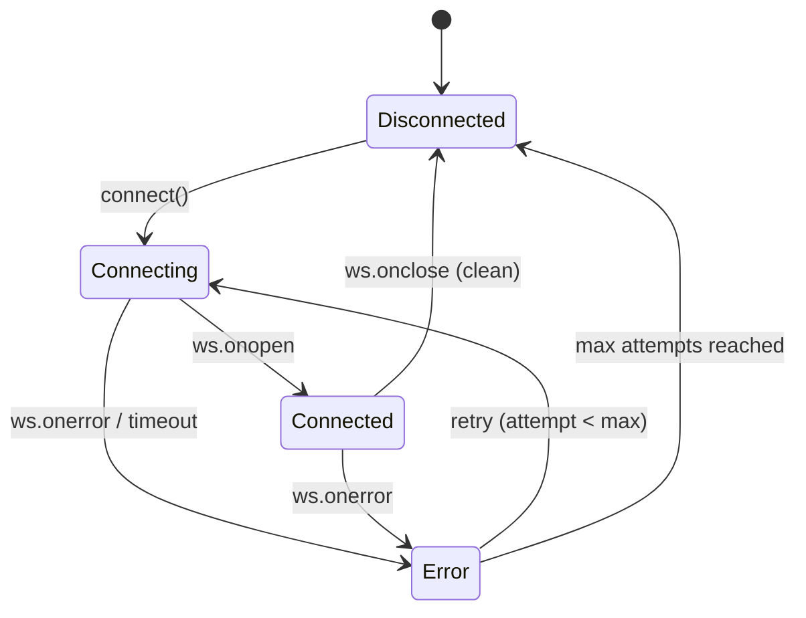
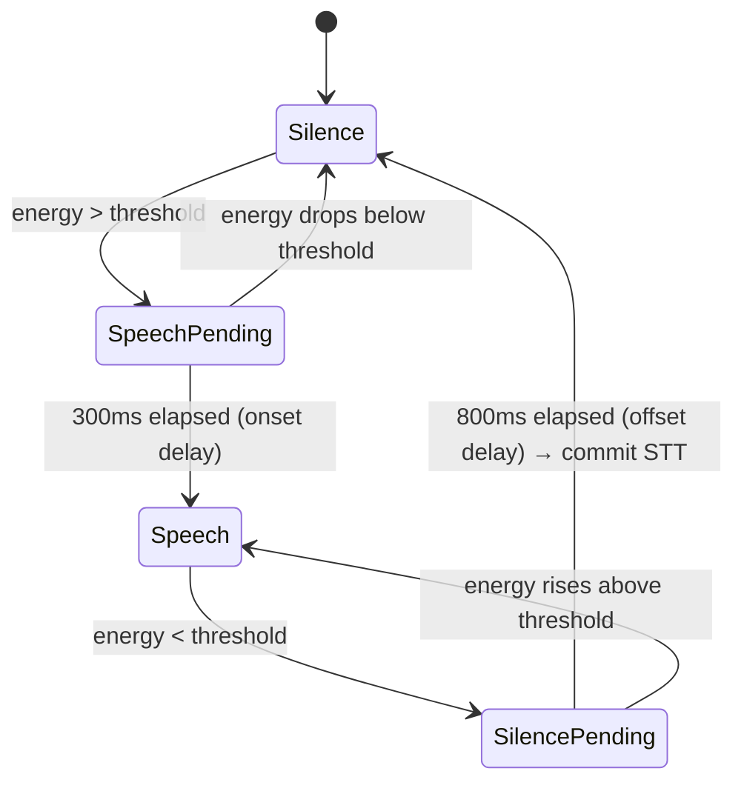
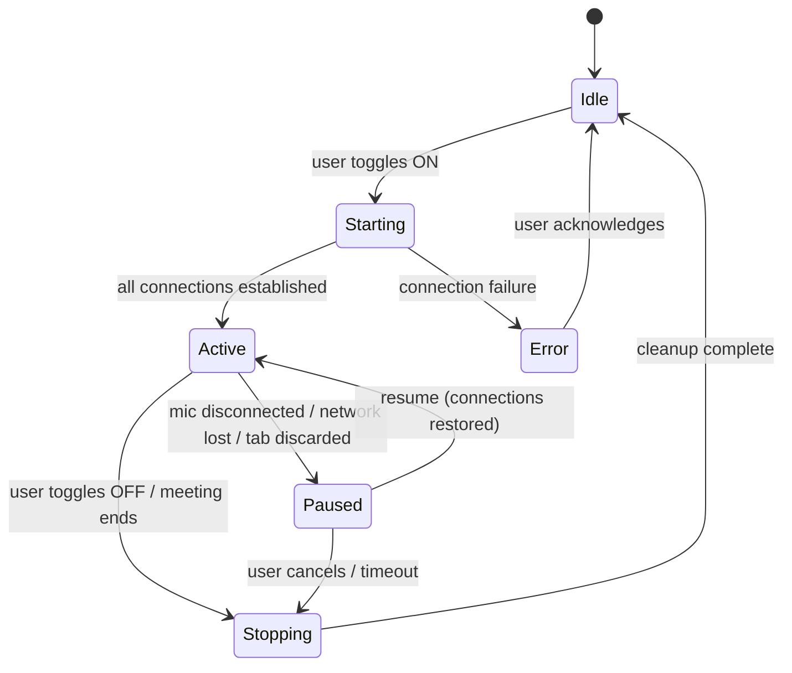
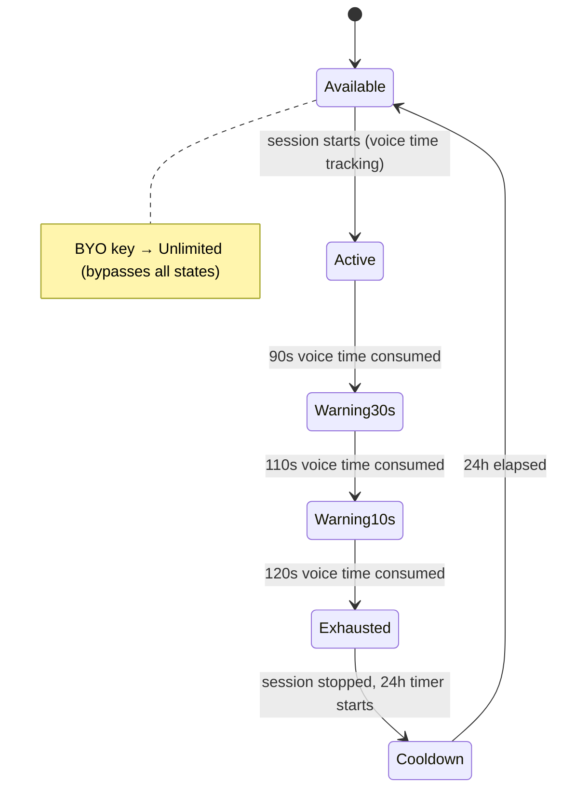

# Design Document: VoiceBridge — Real-Time Voice Translation Chrome Extension

## Overview

VoiceBridge is a Manifest V3 Chrome Extension that provides real-time voice translation during browser-based meetings. The system operates as a streaming pipeline: **Audio Capture → STT → Translation → TTS → Audio Output**, targeting under 2 seconds end-to-end latency.

The extension runs across five Chrome execution contexts — service worker, offscreen document, content script, popup, and side panel — coordinated through a typed message bus. Audio capture and WebSocket connections live in the offscreen document (persistent), while the service worker orchestrates session lifecycle and the content script handles meeting-page audio injection and the floating widget.

The UI follows the Nothing design system: monochrome, typographic, industrial aesthetic with OLED blacks, Space Grotesk + Space Mono + Doto font stack, and mechanical controls.

### Key Design Decisions

1. **Offscreen document as pipeline host**: WebSocket connections (STT, TTS) and audio processing live in the offscreen document because the service worker is ephemeral (~30s idle timeout). The offscreen document provides a persistent DOM context for `AudioContext`, `AudioWorklet`, and WebSocket connections.

2. **Vanilla TypeScript, no framework**: Per steering constraints, all UI is vanilla TS + DOM manipulation. CSS custom properties from the Nothing design tokens handle theming. This keeps bundle size minimal for Chrome Web Store.

3. **Discriminated unions for all state**: Every state machine (echo cancellation, pipeline, connection, VAD) uses TypeScript discriminated unions with exhaustive switch checks — no optional field soup.

4. **Shadow DOM for widget isolation**: The floating widget injects into meeting pages via Shadow DOM to prevent style leakage in both directions.

5. **Token-by-token TTS streaming**: Translation output streams token-by-token to the TTS WebSocket to minimize time-to-first-audio-byte, rather than waiting for complete sentences.

6. **Voice-time tracking for demo limits**: The 2-minute demo limit tracks only VAD-active speech time, not wall-clock time. This is tracked per-install via `crypto.randomUUID()` stored locally.

## Architecture

### High-Level System Diagram



### Data Flow — Single Utterance



### Extension Context Responsibilities

| Context | Lifecycle | Responsibilities |
|---------|-----------|-----------------|
| Service Worker | Ephemeral (~30s idle) | Session orchestration, meeting detection, settings management, alarm scheduling, offscreen document lifecycle |
| Offscreen Document | Persistent (during session) | WebSocket connections (STT/TTS), audio capture/processing, translation, echo cancellation, latency monitoring |
| Content Script | Per-tab (meeting pages) | Floating widget, WebRTC audio injection, platform-specific DOM interaction |
| Popup | On-demand | Controls, language selection, status display, demo limit UI |
| Side Panel | On-demand | Live transcript view, search, export |


## Components and Interfaces

### 1. Message Bus (`message-bus.ts`)

The central nervous system for inter-context communication. All messages are typed, timestamped, and optionally sequenced.

```typescript
type MessageType =
  | 'SESSION_START' | 'SESSION_STOP' | 'SESSION_STATE_CHANGED'
  | 'STT_TRANSCRIPT_PARTIAL' | 'STT_TRANSCRIPT_FINAL' | 'STT_COMMIT'
  | 'TRANSLATION_PARTIAL' | 'TRANSLATION_FINAL'
  | 'TTS_AUDIO_CHUNK' | 'TTS_PLAYBACK_START' | 'TTS_PLAYBACK_END'
  | 'ECHO_STATE_CHANGED' | 'BARGE_IN_DETECTED'
  | 'AUDIO_CAPTURE_START' | 'AUDIO_CAPTURE_STOP' | 'AUDIO_LEVEL'
  | 'CONNECTION_STATE_CHANGED' | 'LATENCY_UPDATE'
  | 'MEETING_DETECTED' | 'MEETING_LOST'
  | 'WIDGET_TOGGLE' | 'WIDGET_POSITION_SAVE'
  | 'LANGUAGE_CHANGED' | 'SETTINGS_UPDATED'
  | 'QUOTA_WARNING' | 'QUOTA_EXHAUSTED'
  | 'DEMO_TIME_UPDATE' | 'DEMO_LIMIT_REACHED' | 'DEMO_RESET'
  | 'VOICE_PROFILE_STATUS' | 'VOICE_PROFILE_PREVIEW'
  | 'ROULETTE_START' | 'ROULETTE_LANGUAGE_CHANGE' | 'ROULETTE_COMPLETE'
  | 'GHOST_MODE_TOGGLE' | 'GHOST_SENSITIVITY_UPDATE'
  | 'ERROR' | 'DEBUG_LOG';

interface ExtensionMessage<T extends MessageType = MessageType> {
  type: T;
  payload: MessagePayloadMap[T];
  timestamp: number;
  sequenceId?: number;
  source: ExtensionContext;
}

type ExtensionContext = 'service-worker' | 'offscreen' | 'content-script' | 'popup' | 'sidepanel';
```

The message bus validates `sender.id` matches the extension ID on every received message. Content script ↔ page communication uses `window.postMessage` with strict origin checking.

**Routing rules:**
- Service Worker → Offscreen: `chrome.runtime.sendMessage`
- Service Worker → Content Script: `chrome.tabs.sendMessage(tabId, msg)`
- Any context → Service Worker: `chrome.runtime.sendMessage`
- Content Script → Page: `window.postMessage` with `{ source: 'voicebridge' }`

### 2. Audio Capture (`audio-capture.ts`)

Manages microphone access, AudioWorklet setup, VAD, chunking, and noise gating. Runs in the offscreen document.

```typescript
interface AudioCaptureConfig {
  sampleRate: 16000;
  channelCount: 1;
  noiseGateThresholdDb: number;       // Default: -40dB, Ghost Mode: -55dB
  vadSpeechOnsetMs: number;           // Default: 300ms
  vadSpeechOffsetMs: number;          // Default: 800ms
  ghostModeGainDb: number;            // Default: 0, Ghost Mode: +20dB
}

type VADState =
  | { status: 'silence' }
  | { status: 'speech-pending'; startedAt: number }
  | { status: 'speech' }
  | { status: 'silence-pending'; startedAt: number };

interface AudioCaptureModule {
  start(config: AudioCaptureConfig): Promise<void>;
  stop(): Promise<void>;
  mute(): void;
  unmute(): void;
  setGhostMode(enabled: boolean): void;
  onAudioChunk: (chunk: Int16Array, sequenceId: number) => void;
  onVADStateChange: (state: VADState) => void;
  onSpeechEnd: () => void;
  getCurrentLevel(): number;  // RMS in dB for UI meters
}
```

**AudioWorklet pipeline:**
1. `getUserMedia({ audio: { echoCancellation: true, noiseSuppression: true, sampleRate: 16000 } })`
2. `MediaStreamSource` → `AudioWorkletNode('audio-processor')` → PCM Int16 via `MessagePort`
3. Main thread accumulates 250ms chunks (4000 samples) in a ring buffer
4. VAD runs on each 10ms frame (160 samples), energy-based with hysteresis
5. Chunks forwarded to STT client only when VAD state is `speech`

### 3. STT Client (`stt-client.ts`)

Manages the WebSocket connection to ElevenLabs Scribe real-time STT.

```typescript
type STTConnectionState =
  | { status: 'disconnected' }
  | { status: 'connecting'; attempt: number }
  | { status: 'connected'; ws: WebSocket; sessionToken: string }
  | { status: 'error'; error: Error; lastAttempt: number };

interface STTConfig {
  encoding: 'pcm_16000';
  languageCode: string;  // BCP 47 or 'auto'
  model: 'scribe_v1';
}

interface STTTranscript {
  text: string;
  language: string;
  isFinal: boolean;
  sequenceId: number;
  timestamp: number;
}

interface STTClient {
  connect(config: STTConfig): Promise<void>;
  disconnect(): Promise<void>;
  sendAudio(chunk: Int16Array): void;
  commit(): void;
  onPartialTranscript: (transcript: STTTranscript) => void;
  onFinalTranscript: (transcript: STTTranscript) => void;
  onConnectionStateChange: (state: STTConnectionState) => void;
  getConnectionState(): STTConnectionState;
}
```

**WebSocket protocol (STT):**
- **Open**: Send config `{ type: "config", encoding: "pcm_16000", language_code, model: "scribe_v1" }`
- **Send audio**: Binary frames — raw PCM Int16 ArrayBuffer, 8000 bytes per 250ms chunk
- **Receive**: JSON `{ type: "transcript.partial" | "transcript.final", text, language }`
- **Commit**: JSON `{ type: "commit" }` — forces finalization on VAD speech-end
- **Heartbeat**: Ping every 15s to detect silent disconnections
- **Reconnect**: Exponential backoff — 500ms, 1s, 2s, 4s, 8s (max 10s), 5 attempts max

### 4. Translation Engine (`translation-engine.ts`)

Sends finalized transcripts to the configured LLM for streaming translation.

```typescript
type LLMProvider = 'openai' | 'anthropic';

interface TranslationConfig {
  provider: LLMProvider;
  apiKey: string;
  sourceLanguage: string;
  targetLanguage: string;
  contextWindowSize: number;        // Default: 10 segments
  preserveTechnicalTerms: boolean;
  customGlossary: GlossaryEntry[];
  meetingContext: string;            // Optional domain hint
  formalityLevel: 'formal' | 'informal';
  shortUtteranceBufferMs: number;   // Default: 1500ms for < 3 words
}

interface GlossaryEntry {
  source: string;
  target: string;
}

interface TranslationResult {
  sequenceId: number;
  sourceText: string;
  translatedText: string;
  isStreaming: boolean;
  tokens: string[];  // Individual tokens as they arrive
}

interface TranslationEngine {
  translate(transcript: STTTranscript): AsyncGenerator<string>;
  setLanguagePair(source: string, target: string): void;
  setConfig(config: Partial<TranslationConfig>): void;
  getContextWindow(): Array<{ source: string; translated: string }>;
}
```

**Translation strategy:**
- System prompt instructs: translate naturally, preserve tone, handle idioms, output only translated text
- Sliding context window: last N finalized pairs (source + translation) prepended to each request
- Short utterance buffering: segments < 3 words wait 1.5s for continuation before translating
- Streaming: tokens forwarded to TTS client as they arrive from the LLM
- Preservation markers: code snippets, URLs, emails, numbers wrapped before sending to LLM
- Length guard: if translation > 3× source length, re-request with "be concise" instruction

### 5. TTS Client (`tts-client.ts`)

Manages the WebSocket connection to ElevenLabs streaming TTS.

```typescript
type TTSConnectionState =
  | { status: 'disconnected' }
  | { status: 'connecting'; attempt: number }
  | { status: 'connected'; ws: WebSocket }
  | { status: 'error'; error: Error; lastAttempt: number };

interface TTSConfig {
  voiceId: string;
  modelId: 'eleven_multilingual_v2';
  outputFormat: 'pcm_24000';
  voiceSettings: VoiceSettings;
}

interface VoiceSettings {
  stability: number;          // 0.0-1.0, default 0.5, Ghost Mode: 0.7
  similarityBoost: number;    // 0.0-1.0, default 0.75
  style: number;              // 0.0-1.0, default 0.3
  useSpeakerBoost: boolean;   // default true
}

interface TTSClient {
  connect(config: TTSConfig): Promise<void>;
  disconnect(): Promise<void>;
  sendText(text: string): void;
  flush(): void;
  cancel(): void;
  onAudioChunk: (pcm: Int16Array, sequenceId: number) => void;
  onConnectionStateChange: (state: TTSConnectionState) => void;
  getConnectionState(): TTSConnectionState;
}
```

**WebSocket protocol (TTS):**
- **Open**: Send initial config `{ text: " ", voice_settings, xi_api_key, output_format: "pcm_24000" }`
- **Stream text**: `{ text: "<token>", try_trigger_generation: true }` — token-by-token
- **Flush**: `{ text: "", flush: true }` — end of utterance, force generation
- **Cancel**: `{ text: "", flush: true }` + discard local audio queue — on barge-in
- **Receive audio**: Binary frames — PCM Int16 24kHz, or JSON with base64 `audio` field
- **Long sentence splitting**: Sentences > 50 words split at clause boundaries (commas, semicolons, conjunctions)

### 6. Audio Output (`audio-output.ts`)

Routes TTS audio to the meeting via WebRTC track replacement. Runs in the offscreen document, coordinates with content script for track injection.

```typescript
interface AudioOutputConfig {
  outputSampleRate: 48000;
  bufferSizeMs: 100;
  fadeOutMs: 50;  // Barge-in fade duration
}

interface AudioOutputModule {
  initialize(config: AudioOutputConfig): Promise<void>;
  playAudio(pcm24k: Int16Array, sequenceId: number): Promise<void>;
  stopPlayback(): void;
  fadeOut(durationMs: number): void;
  getVirtualTrack(): MediaStreamTrack;
  normalizeVolume(referenceLevel: number): void;
  isPlaying(): boolean;
  destroy(): Promise<void>;
}
```

**Audio format conversion pipeline:**
1. Receive PCM Int16 at 24kHz from TTS client
2. Convert Int16 → Float32: `sample / 32768.0`
3. Create `AudioBuffer` at 48kHz (browser resamples via `AudioContext({ sampleRate: 48000 })`)
4. Route through `GainNode` (volume normalization) → `MediaStreamDestination`
5. Virtual `MediaStreamTrack` sent to content script for WebRTC injection
6. 100ms playback buffer to prevent underruns

### 7. Echo Cancellation (`echo-cancellation.ts`)

Pure state machine preventing TTS audio from being re-captured by the microphone.

```typescript
type EchoState =
  | { status: 'listening' }
  | { status: 'speaking'; ttsStartedAt: number }
  | { status: 'transitioning'; ttsEndedAt: number };

type EchoEvent =
  | { type: 'tts_start' }
  | { type: 'tts_end' }
  | { type: 'transition_complete' }
  | { type: 'barge_in' };

function transitionEchoState(current: EchoState, event: EchoEvent): EchoState {
  switch (current.status) {
    case 'listening':
      if (event.type === 'tts_start') return { status: 'speaking', ttsStartedAt: Date.now() };
      return current;
    case 'speaking':
      if (event.type === 'barge_in') return { status: 'listening' };
      if (event.type === 'tts_end') return { status: 'transitioning', ttsEndedAt: Date.now() };
      return current;
    case 'transitioning':
      if (event.type === 'transition_complete') return { status: 'listening' };
      if (event.type === 'barge_in') return { status: 'listening' };
      return current;
  }
}
```

**State machine rules:**
- `LISTENING`: Mic active, no TTS playing. Normal STT pipeline.
- `SPEAKING`: TTS playing, mic muted. Prevents feedback loop.
- `TRANSITIONING`: 200ms buffer after TTS ends. Mic still muted (echo tail dissipation).
- **Barge-in**: VAD detects speech during `SPEAKING` → fade out TTS (50ms), cancel TTS WebSocket, discard queued audio, transition to `LISTENING` within 100ms.
- **Ghost Mode override**: No barge-in detection. Mic stays fully muted during `SPEAKING` (whisper input too sensitive for barge-in discrimination).

### 8. Meeting Detector (`meeting-detector.ts`)

Identifies the active meeting platform from the current tab URL and selects the appropriate audio injection strategy.

```typescript
type MeetingPlatform = 'google-meet' | 'zoom' | 'teams' | 'discord' | 'generic' | 'none';

type AudioInjectionStrategy =
  | { type: 'getUserMedia-intercept' }     // Google Meet
  | { type: 'tabCapture-mix' }             // Zoom
  | { type: 'replaceTrack' }               // Teams, Discord, generic
  | { type: 'none' };

interface MeetingDetector {
  detect(url: string): MeetingPlatform;
  getInjectionStrategy(platform: MeetingPlatform): AudioInjectionStrategy;
  onPlatformChange: (platform: MeetingPlatform) => void;
}

const PLATFORM_PATTERNS: Record<MeetingPlatform, RegExp> = {
  'google-meet': /^https:\/\/meet\.google\.com\/.+/,
  'zoom': /^https:\/\/[\w.]*zoom\.us\/wc\/.+/,
  'teams': /^https:\/\/teams\.microsoft\.com\/.+/,
  'discord': /^https:\/\/discord\.com\/channels\/.+/,
  'generic': /.*/,  // Fallback — only with "Force Enable"
  'none': /^$/,
};
```

**Platform-specific injection:**
- **Google Meet**: Intercept `navigator.mediaDevices.getUserMedia` before page loads via main-world script injection. Provide virtual `MediaStream` as the mic source.
- **Zoom Web**: Uses custom media stack that restricts `replaceTrack`. Fall back to `chrome.tabCapture` API to mix TTS audio into tab output.
- **Microsoft Teams**: Standard `RTCPeerConnection.getSenders()` → `sender.replaceTrack(virtualTrack)`.
- **Discord**: Standard `replaceTrack` on `RTCPeerConnection`.
- **Generic**: Attempt `replaceTrack` on any detected `RTCPeerConnection`. User-triggered via "Force Enable".

### 9. Voice Profile (`voice-profile.ts`)

Manages voice clone creation, storage, deletion, and preview via the ElevenLabs REST API.

```typescript
type VoiceProfileState =
  | { status: 'not-set-up' }
  | { status: 'recording'; durationMs: number }
  | { status: 'uploading'; progress: number }
  | { status: 'processing' }
  | { status: 'ready'; voiceId: string; createdAt: number }
  | { status: 'error'; error: string };

interface VoiceProfile {
  getState(): VoiceProfileState;
  startRecording(): Promise<void>;
  stopRecording(): Promise<Blob>;
  upload(audioBlob: Blob): Promise<string>;
  delete(): Promise<void>;
  preview(text: string, language: string): Promise<ArrayBuffer>;
  validateSample(blob: Blob): Result<void, VoiceSampleError>;
  onStateChange: (state: VoiceProfileState) => void;
}

type VoiceSampleError =
  | { code: 'too-short'; minDurationMs: 30000 }
  | { code: 'too-long'; maxDurationMs: 120000 }
  | { code: 'too-noisy'; averageRmsDb: number; thresholdDb: -30 };
```

### 10. Settings Store (`settings-store.ts`)

Typed wrapper around `chrome.storage.local` and `chrome.storage.sync` with encryption for sensitive data.

```typescript
interface SettingsSchema {
  // Encrypted (chrome.storage.local only)
  elevenLabsApiKey: string;
  llmApiKey: string;

  // Synced (chrome.storage.sync)
  llmProvider: LLMProvider;
  sourceLanguage: string;
  targetLanguage: string;
  recentLanguages: string[];
  contextWindowSize: number;
  preserveTechnicalTerms: boolean;
  customGlossary: GlossaryEntry[];
  meetingContext: string;
  formalityLevel: 'formal' | 'informal';
  noiseGateThresholdDb: number;
  vadSensitivity: 'low' | 'medium' | 'high';
  echoCancellationMode: 'auto' | 'aggressive' | 'off';
  voiceStability: number;
  voiceSimilarityBoost: number;
  voiceStyle: number;
  latencyPriority: number;  // 0.0 (quality) to 1.0 (speed)
  maxConcurrentRequests: 1 | 2 | 3;
  pushToTranslateKey: string;
  demoMode: boolean;
  ghostMode: boolean;
  rouletteLanguages: string[];
  theme: 'dark' | 'light' | 'system';

  // Local only (chrome.storage.local)
  voiceProfileId: string;
  installId: string;
  onboardingComplete: boolean;
  widgetPositions: Record<string, { x: number; y: number }>;
  languageCache: { stt: string[]; tts: string[]; cachedAt: number };
  demoUsage: DemoUsageState;
  dailyUsageHistory: DailyUsage[];
  extensionVersion: string;
  embeddedKeyExhausted: boolean;
  embeddedKeyLastChecked: number;
}

interface DemoUsageState {
  voiceTimeUsedMs: number;
  windowStartTimestamp: number;
  installId: string;
}

interface DailyUsage {
  date: string;  // ISO date
  ttsCharacters: number;
  sttSeconds: number;
  llmTokens: number;
  estimatedCostUsd: number;
}
```

**Encryption**: API keys encrypted with AES-GCM-256 via Web Crypto API. The encryption key is derived from the extension ID + a per-install salt using PBKDF2. Keys are decrypted only in the offscreen document or service worker — never in content scripts.

### 11. Latency Monitor (`latency-monitor.ts`)

Tracks per-stage and end-to-end latency for each utterance.

```typescript
interface LatencyMeasurement {
  sequenceId: number;
  captureMs: number;       // Audio capture + chunking (fixed ~250ms)
  sttMs: number;           // Speech-end to transcript.final
  translationMs: number;   // Transcript to first translated token
  ttsMs: number;           // First text token to first audio byte
  routingMs: number;       // Audio output buffer + routing
  totalMs: number;         // End-to-end
  timestamp: number;
}

interface LatencyMonitor {
  markCaptureStart(sequenceId: number): void;
  markCaptureEnd(sequenceId: number): void;
  markSTTEnd(sequenceId: number): void;
  markTranslationStart(sequenceId: number): void;
  markTranslationFirstToken(sequenceId: number): void;
  markTTSFirstByte(sequenceId: number): void;
  markPlaybackStart(sequenceId: number): void;
  getMeasurement(sequenceId: number): LatencyMeasurement | undefined;
  getAverageLatency(windowSize?: number): LatencyMeasurement;
  getLatencyHistory(): LatencyMeasurement[];
  onLatencyUpdate: (measurement: LatencyMeasurement) => void;
}
```

**Latency budget:**

| Stage | Budget | Measurement Point |
|-------|--------|-------------------|
| Audio capture + chunking | 250ms | Fixed (chunk size) |
| STT (speech-end → transcript) | 500ms | WebSocket round-trip |
| Translation (transcript → first token) | 300ms | LLM streaming start |
| TTS (text → first audio byte) | 300ms | WebSocket round-trip |
| Audio routing + buffer | 100ms | Fixed overhead |
| Headroom | 550ms | Network variance |
| **Total target** | **< 2000ms** | End-to-end |


## Data Models

### Core Pipeline Types

```typescript
/** Pipeline utterance — tracks a single speech segment through all stages */
interface PipelineUtterance {
  sequenceId: number;
  state: PipelineStage;
  capturedAt: number;
  transcript?: string;
  detectedLanguage?: string;
  translation?: string;
  audioChunks: ArrayBuffer[];
  droppedReason?: string;
  latency?: LatencyMeasurement;
}

type PipelineStage =
  | 'CAPTURED'
  | 'TRANSCRIBED'
  | 'TRANSLATED'
  | 'SYNTHESIZED'
  | 'PLAYED'
  | 'DROPPED';

/** Session state — persisted to chrome.storage.session */
interface SessionState {
  active: boolean;
  startedAt: number;
  sourceLanguage: string;
  targetLanguage: string;
  totalUtterances: number;
  droppedUtterances: number;
  currentSequenceId: number;
  voiceTimeMs: number;
  ttsCharactersUsed: number;
  sttSecondsUsed: number;
  llmTokensUsed: number;
}

/** Transcript pair for side panel display */
interface TranscriptEntry {
  sequenceId: number;
  timestamp: number;
  originalText: string;
  translatedText: string;
  sourceLanguage: string;
  targetLanguage: string;
  isFinal: boolean;
  latencyMs: number;
}
```

### Connection and Service Types

```typescript
/** Unified connection state for all WebSocket/API connections */
type ServiceConnectionState =
  | { status: 'disconnected' }
  | { status: 'connecting'; attempt: number }
  | { status: 'connected' }
  | { status: 'error'; error: string; retryable: boolean };

/** Pipeline health — aggregated for UI display */
interface PipelineHealth {
  stt: ServiceConnectionState;
  tts: ServiceConnectionState;
  llm: ServiceConnectionState;
  overallStatus: 'healthy' | 'degraded' | 'offline';
}

/** Quota state */
interface QuotaState {
  elevenLabsCharactersUsed: number;
  elevenLabsCharactersLimit: number;
  percentUsed: number;
  warningLevel: 'none' | 'warning' | 'urgent' | 'exhausted';
}
```

### Demo and Usage Types

```typescript
/** Demo mode state */
type DemoModeState =
  | { mode: 'demo'; voiceTimeRemainingMs: number; windowResetsAt: number }
  | { mode: 'unlimited'; apiKeySource: 'byo' }
  | { mode: 'disabled'; reason: 'embedded-key-exhausted' | 'limit-reached'; resetsAt?: number };

/** Language support tier */
interface LanguageInfo {
  code: string;          // BCP 47
  name: string;          // Display name
  nativeName: string;    // Name in the language itself
  sttSupported: boolean;
  ttsSupported: boolean;
  tier: 'full' | 'text-only';
}

/** Language Roulette state */
type RouletteState =
  | { status: 'idle' }
  | { status: 'capturing' }
  | { status: 'playing'; currentIndex: number; totalLanguages: number; currentLanguage: string }
  | { status: 'complete' };
```

### Widget and UI Types

```typescript
/** Floating widget display state */
type WidgetDisplayState =
  | { mode: 'collapsed'; icon: WidgetIcon }
  | { mode: 'expanded'; latencyMs: number; languagePair: string; sessionDuration: string; statusColor: string }
  | { mode: 'error'; message: string }
  | { mode: 'roulette'; currentLanguage: string; progress: number }
  | { mode: 'ghost'; sensitivityLevel: number };

type WidgetIcon = 'microphone' | 'globe' | 'speaker' | 'pause' | 'ghost' | 'offline';

/** Debug log entry */
interface DebugLogEntry {
  timestamp: number;
  level: 'info' | 'warn' | 'error';
  category: 'connection' | 'audio' | 'pipeline' | 'api' | 'state' | 'quota';
  message: string;
  metadata?: Record<string, unknown>;
}
```

## WebSocket Message Protocols

### STT WebSocket Protocol (ElevenLabs Scribe)

```
Endpoint: wss://api.elevenlabs.io/v1/speech-to-text/stream

── Client → Server ──────────────────────────────────────────

1. Config (on open):
   { "type": "config", "encoding": "pcm_16000", "language_code": "en" | "auto", "model": "scribe_v1" }

2. Audio data:
   Binary frame: raw PCM Int16 ArrayBuffer (8000 bytes = 250ms at 16kHz)

3. Commit (force finalization):
   { "type": "commit" }

4. End of stream:
   { "type": "end_of_stream" }

── Server → Client ──────────────────────────────────────────

1. Partial transcript:
   { "type": "transcript.partial", "text": "Hello how are", "language": "en" }

2. Final transcript:
   { "type": "transcript.final", "text": "Hello, how are you?", "language": "en" }

3. Error:
   { "type": "error", "message": "...", "code": "..." }

── Lifecycle ────────────────────────────────────────────────

- Token: Obtained via POST /v1/speech-to-text/stream/token (single-use, per-session)
- Heartbeat: Client sends WebSocket ping every 15s
- Reconnect: Exponential backoff 500ms → 10s, max 5 attempts
```

### TTS WebSocket Protocol (ElevenLabs Streaming)

```
Endpoint: wss://api.elevenlabs.io/v1/text-to-speech/{voiceId}/stream-input?model_id=eleven_multilingual_v2

── Client → Server ──────────────────────────────────────────

1. Init (on open):
   {
     "text": " ",
     "voice_settings": { "stability": 0.5, "similarity_boost": 0.75, "style": 0.3, "use_speaker_boost": true },
     "xi_api_key": "<key>",
     "output_format": "pcm_24000"
   }

2. Stream text (token-by-token):
   { "text": "<token>", "try_trigger_generation": true }

3. Flush (end of utterance):
   { "text": "", "flush": true }

── Server → Client ──────────────────────────────────────────

1. Audio chunk:
   Binary frame: PCM Int16 24kHz audio data

2. JSON audio (alternative):
   { "audio": "<base64-encoded-pcm>", "isFinal": false }

3. Generation complete:
   { "isFinal": true }

── Lifecycle ────────────────────────────────────────────────

- Auth: xi_api_key in initial message
- Cancel: Send flush + discard local audio queue
- Heartbeat: Client sends WebSocket ping every 15s
- Reconnect: Same backoff strategy as STT
```

## State Machine Definitions

### 1. Echo Cancellation State Machine



| State | Mic | TTS | Duration | Transitions |
|-------|-----|-----|----------|-------------|
| `listening` | Active | Silent | Indefinite | → `speaking` on TTS start |
| `speaking` | Muted | Playing | Until TTS ends | → `transitioning` on TTS end, → `listening` on barge-in |
| `transitioning` | Muted | Silent | 200ms fixed | → `listening` after 200ms |

### 2. Pipeline Connection State Machine



### 3. VAD State Machine



### 4. Session Lifecycle State Machine



### 5. Demo Quota State Machine




## Inter-Context Communication Protocol

### Message Routing Map

```
┌─────────────────┐     chrome.runtime.sendMessage      ┌──────────────────┐
│  Service Worker  │◄───────────────────────────────────►│ Offscreen Document│
│  (orchestrator)  │                                     │ (pipeline host)   │
└────────┬────────┘                                     └──────────────────┘
         │
         │ chrome.tabs.sendMessage (tabId)
         │ chrome.runtime.sendMessage (reverse)
         ▼
┌─────────────────┐     window.postMessage (origin)     ┌──────────────────┐
│  Content Script  │◄───────────────────────────────────►│  Meeting Page     │
│  (isolated world)│                                     │  (main world)     │
└─────────────────┘                                     └──────────────────┘
         ▲
         │ chrome.runtime.sendMessage
         │
┌────────┴────────┐
│  Popup / Panel   │
└─────────────────┘
```

### Message Payload Type Map

```typescript
interface MessagePayloadMap {
  SESSION_START: { sourceLanguage: string; targetLanguage: string };
  SESSION_STOP: { reason: 'user' | 'error' | 'quota' | 'demo-limit' | 'tab-closed' };
  SESSION_STATE_CHANGED: SessionState;

  STT_TRANSCRIPT_PARTIAL: { text: string; language: string; sequenceId: number };
  STT_TRANSCRIPT_FINAL: { text: string; language: string; sequenceId: number };
  STT_COMMIT: { sequenceId: number };

  TRANSLATION_PARTIAL: { text: string; sequenceId: number };
  TRANSLATION_FINAL: { text: string; sequenceId: number };

  TTS_AUDIO_CHUNK: { buffer: ArrayBuffer; sequenceId: number };
  TTS_PLAYBACK_START: { sequenceId: number };
  TTS_PLAYBACK_END: { sequenceId: number };

  ECHO_STATE_CHANGED: { state: EchoState };
  BARGE_IN_DETECTED: { sequenceId: number };

  AUDIO_CAPTURE_START: undefined;
  AUDIO_CAPTURE_STOP: undefined;
  AUDIO_LEVEL: { rmsDb: number; vadState: VADState['status'] };

  CONNECTION_STATE_CHANGED: { service: 'stt' | 'tts' | 'llm'; state: ServiceConnectionState };
  LATENCY_UPDATE: LatencyMeasurement;

  MEETING_DETECTED: { platform: MeetingPlatform; tabId: number };
  MEETING_LOST: { tabId: number };

  WIDGET_TOGGLE: undefined;
  WIDGET_POSITION_SAVE: { domain: string; x: number; y: number };

  LANGUAGE_CHANGED: { sourceLanguage: string; targetLanguage: string };
  SETTINGS_UPDATED: Partial<SettingsSchema>;

  QUOTA_WARNING: { level: 'warning' | 'urgent'; percentUsed: number };
  QUOTA_EXHAUSTED: undefined;

  DEMO_TIME_UPDATE: { voiceTimeRemainingMs: number; voiceTimeUsedMs: number };
  DEMO_LIMIT_REACHED: { resetsAt: number };
  DEMO_RESET: { voiceTimeAvailableMs: number };

  VOICE_PROFILE_STATUS: VoiceProfileState;
  VOICE_PROFILE_PREVIEW: { audioBuffer: ArrayBuffer };

  ROULETTE_START: { sentence: string; languages: string[] };
  ROULETTE_LANGUAGE_CHANGE: { language: string; index: number; total: number };
  ROULETTE_COMPLETE: undefined;

  GHOST_MODE_TOGGLE: { enabled: boolean };
  GHOST_SENSITIVITY_UPDATE: { level: number };

  ERROR: { code: string; message: string; userMessage: string; action?: string };
  DEBUG_LOG: DebugLogEntry;
}
```

### Security Validation

Every message handler validates the sender:

```typescript
// SECURITY: Validate message origin
chrome.runtime.onMessage.addListener((message, sender, sendResponse) => {
  if (sender.id !== chrome.runtime.id) return;  // Reject external messages
  // Process message...
});

// SECURITY: Content script ↔ page communication
window.addEventListener('message', (event) => {
  if (event.origin !== window.location.origin) return;
  if (event.data?.source !== 'voicebridge') return;
  // Process message...
});
```

### Audio Data Transfer

Audio buffers between offscreen document and content script use `Transferable` objects for zero-copy transfer:

```typescript
// Offscreen → Content Script (via service worker relay)
chrome.runtime.sendMessage({
  type: 'TTS_AUDIO_CHUNK',
  payload: { buffer: pcmBuffer, sequenceId },
  timestamp: Date.now()
}, undefined, [pcmBuffer]);  // Transfer ownership
```

For high-frequency audio data, a `MessageChannel` port pair is established between offscreen and content script at session start, bypassing the service worker for audio frames.

## Audio Format Pipeline

### Format Conversion Chain

```
Microphone (device native, typically 44.1/48kHz Float32)
    │
    ▼ AudioContext({ sampleRate: 16000 })
    │  Browser resamples to 16kHz automatically
    │
AudioWorklet (Float32 → Int16 conversion)
    │  pcm16[i] = clamp(float32[i], -1, 1) * (float32[i] < 0 ? 0x8000 : 0x7FFF)
    │
    ▼ Ring buffer accumulates 4000 samples (250ms)
    │
STT WebSocket (PCM Int16, 16kHz, mono, 8000 bytes/chunk)
    │
    ▼ transcript.final
    │
Translation Engine (text)
    │
    ▼ translated tokens
    │
TTS WebSocket (PCM Int16, 24kHz, mono)
    │
    ▼ Int16 → Float32 conversion
    │  float32[i] = int16[i] / 32768.0
    │
AudioContext({ sampleRate: 48000 })
    │  Browser resamples 24kHz → 48kHz via sinc interpolation
    │
GainNode (volume normalization)
    │
MediaStreamDestination → virtual MediaStreamTrack
    │
    ▼ replaceTrack() on RTCPeerConnection
    │
WebRTC (Opus codec, 48kHz, 48kbps)
```

### Buffer Management

| Buffer | Size | Purpose |
|--------|------|---------|
| AudioWorklet ring buffer | 4000 samples (250ms) | Accumulate before sending to STT |
| STT reconnection queue | 10s of audio (160,000 samples) | Buffer during brief disconnections |
| TTS playback buffer | 100ms | Prevent audio underruns |
| Pipeline utterance queue | Max 3 utterances | Backpressure management |
| Transcript store | Max 500 entries | Side panel display |
| Debug log | 200 entries (circular) | Diagnostics |

### Memory Limits

- Max audio in memory: 10 seconds (per ElevenLabs steering)
- Audio buffers cleared immediately after sending
- `Transferable` objects used for all cross-context audio transfers
- `MediaStream` tracks stopped on session end: `track.stop()`
- `AudioContext` closed when not in use: `ctx.close()`

## Meeting Platform Integration Strategies

### Google Meet

```typescript
// Inject into main world BEFORE page loads (via manifest content_scripts with run_at: "document_start")
// Intercept getUserMedia to provide virtual stream

const originalGetUserMedia = navigator.mediaDevices.getUserMedia.bind(navigator.mediaDevices);

navigator.mediaDevices.getUserMedia = async function(constraints) {
  const stream = await originalGetUserMedia(constraints);

  if (constraints?.audio) {
    // Store original track for restoration
    window.postMessage({
      source: 'voicebridge',
      type: 'ORIGINAL_MIC_TRACK',
      trackId: stream.getAudioTracks()[0]?.id
    }, window.location.origin);
  }

  return stream;  // Return original initially; replace track later when session starts
};
```

When session starts, the content script replaces the audio track on the `RTCPeerConnection` sender.

### Zoom Web Client

Zoom's custom media stack restricts direct track replacement. Fallback strategy:

1. Use `chrome.tabCapture.capture()` to get the tab's audio stream
2. Create an `AudioContext` mixing node
3. Mix TTS audio into the tab's audio output
4. The mixed audio reaches Zoom's media stack through the tab's audio context

### Microsoft Teams / Discord

Standard WebRTC approach:

```typescript
// Find active RTCPeerConnection (injected main-world script monitors RTCPeerConnection constructor)
const peerConnections: RTCPeerConnection[] = [];

const OriginalRTCPeerConnection = window.RTCPeerConnection;
window.RTCPeerConnection = function(...args) {
  const pc = new OriginalRTCPeerConnection(...args);
  peerConnections.push(pc);
  window.postMessage({ source: 'voicebridge', type: 'RTC_PC_CREATED' }, window.location.origin);
  return pc;
} as unknown as typeof RTCPeerConnection;

// When session starts:
async function injectVirtualAudio(virtualTrack: MediaStreamTrack) {
  for (const pc of peerConnections) {
    const sender = pc.getSenders().find(s => s.track?.kind === 'audio');
    if (sender) {
      await sender.replaceTrack(virtualTrack);
      break;
    }
  }
}
```

### Track Lifecycle

1. **Session start**: Store reference to original mic track, replace with virtual track
2. **During TTS playback**: Virtual track carries TTS audio
3. **During user speech**: Virtual track carries original mic audio (passthrough)
4. **Session end**: Restore original mic track via `sender.replaceTrack(originalTrack)`
5. **Barge-in**: Fade out TTS on virtual track, switch to mic passthrough within 100ms

## Security Model

### API Key Protection

```
┌─────────────────────────────────────────────────────────┐
│                    Key Storage Flow                      │
│                                                          │
│  User enters key → PBKDF2(extensionId + installSalt)    │
│                     → AES-GCM-256 encrypt                │
│                     → chrome.storage.local               │
│                                                          │
│  Key needed → chrome.storage.local                       │
│              → AES-GCM-256 decrypt                       │
│              → use in offscreen/service-worker ONLY      │
│              → NEVER sent to content script              │
└─────────────────────────────────────────────────────────┘
```

**Encryption implementation:**
- Algorithm: AES-GCM with 256-bit key
- Key derivation: PBKDF2 with `chrome.runtime.id` + per-install random salt (100,000 iterations, SHA-256)
- IV: Random 12 bytes per encryption, stored alongside ciphertext
- Storage: `{ iv: base64, ciphertext: base64, salt: base64 }` in `chrome.storage.local`

### Content Security Policy

```json
{
  "content_security_policy": {
    "extension_pages": "script-src 'self'; object-src 'none'"
  }
}
```

### Trust Boundaries

| Context | Trust Level | Can Access API Keys | Can Access Audio |
|---------|-------------|--------------------|--------------------|
| Service Worker | High | Yes (encrypted) | No (no AudioContext) |
| Offscreen Document | High | Yes (decrypted for WebSocket) | Yes (AudioWorklet) |
| Content Script | Medium | No | Yes (WebRTC injection only) |
| Popup / Side Panel | Medium | No | No |
| Meeting Page (main world) | Low | No | No (only receives virtual track) |

### Message Validation

- All `chrome.runtime.onMessage` handlers check `sender.id === chrome.runtime.id`
- Content script ↔ page messages use `window.postMessage` with origin check and `source: 'voicebridge'` marker
- Audio data messages include `sequenceId` for ordering validation
- No raw API keys in any message payload — only the offscreen document holds decrypted keys

### Embedded Demo Key Obfuscation

The embedded demo API key is stored as a split, base64-encoded string assembled at runtime. This is not true security (client-side code is inspectable), but prevents casual extraction:

```typescript
// SECURITY: Obfuscated, not secure. Prevents casual copy-paste extraction only.
const DEMO_KEY_PARTS = [/* split base64 segments set at build time */];
function assembleDemoKey(): string {
  return atob(DEMO_KEY_PARTS.join(''));
}
```

## Build and Bundling Strategy

### Vite Configuration

```
vite.config.ts
├── Entry points:
│   ├── src/background/service-worker.ts    → dist/service-worker.js
│   ├── src/offscreen/offscreen.ts          → dist/offscreen/offscreen.js
│   ├── src/content/content-script.ts       → dist/content/content-script.js
│   ├── src/content/widget.ts               → dist/content/widget.js
│   ├── src/popup/popup.ts                  → dist/popup/popup.js
│   ├── src/sidepanel/sidepanel.ts          → dist/sidepanel/sidepanel.js
│   ├── src/options/options.ts              → dist/options/options.js
│   ├── src/onboarding/onboarding.ts        → dist/onboarding/onboarding.js
│   └── src/worklets/audio-processor.worklet.ts → dist/worklets/audio-processor.worklet.js
│
├── HTML pages (copied):
│   ├── src/offscreen/offscreen.html
│   ├── src/popup/popup.html
│   ├── src/sidepanel/sidepanel.html
│   ├── src/options/options.html
│   └── src/onboarding/onboarding.html
│
├── Static assets (copied):
│   ├── src/manifest.json
│   ├── src/styles/tokens.css
│   ├── src/styles/widget.css
│   └── src/styles/shared.css
│
└── Build flags:
    ├── VITE_DEMO_API_KEY          → Embedded demo key (optional)
    ├── VITE_DEMO_KEY_ENABLED      → Enable/disable embedded key
    └── VITE_VERSION               → Extension version string
```

### Dependencies

| Package | Purpose | Size Impact |
|---------|---------|-------------|
| `@elevenlabs/elevenlabs-js` | REST API client (voice cloning, subscription, languages) | ~50KB |
| `lucide-static` | Monoline SVG icons (tree-shakeable) | ~5KB (used icons only) |
| `vite` | Build tool | Dev only |
| `vitest` | Test runner | Dev only |
| `fast-check` | Property-based testing | Dev only |

No React, Vue, Svelte, Tailwind, Lodash, or state management libraries.

### Manifest V3 Structure

```json
{
  "manifest_version": 3,
  "name": "VoiceBridge",
  "version": "1.0.0",
  "description": "Real-time voice translation for meetings",
  "permissions": ["activeTab", "sidePanel", "storage", "tabCapture", "offscreen"],
  "host_permissions": [
    "https://meet.google.com/*",
    "https://zoom.us/*",
    "https://teams.microsoft.com/*",
    "https://discord.com/*",
    "https://api.elevenlabs.io/*"
  ],
  "background": {
    "service_worker": "service-worker.js",
    "type": "module"
  },
  "content_scripts": [{
    "matches": [
      "https://meet.google.com/*",
      "https://*.zoom.us/*",
      "https://teams.microsoft.com/*",
      "https://discord.com/channels/*"
    ],
    "js": ["content/content-script.js"],
    "css": ["styles/widget.css"],
    "run_at": "document_start"
  }],
  "action": {
    "default_popup": "popup/popup.html"
  },
  "side_panel": {
    "default_path": "sidepanel/sidepanel.html"
  },
  "options_page": "options/options.html",
  "commands": {
    "toggle-translation": { "suggested_key": { "default": "Alt+T" }, "description": "Toggle translation" },
    "push-to-translate": { "suggested_key": { "default": "Ctrl+Space" }, "description": "Push to translate (hold)" },
    "panic-stop": { "suggested_key": { "default": "Ctrl+Shift+X" }, "description": "Emergency stop" },
    "toggle-ghost-mode": { "suggested_key": { "default": "Alt+G" }, "description": "Toggle Ghost Mode" },
    "language-roulette": { "suggested_key": { "default": "Alt+R" }, "description": "Language Roulette" }
  },
  "content_security_policy": {
    "extension_pages": "script-src 'self'; object-src 'none'"
  }
}
```


## Correctness Properties

*A property is a characteristic or behavior that should hold true across all valid executions of a system — essentially, a formal statement about what the system should do. Properties serve as the bridge between human-readable specifications and machine-verifiable correctness guarantees.*

### Property 1: Audio Format Round-Trip

*For any* Float32 audio sample in the range [-1.0, 1.0], converting to Int16 (PCM 16-bit) and back to Float32 should produce a value within ±1/32768 of the original (quantization error bound).

**Validates: Requirements 2.2, 23.4, 23.5**

### Property 2: Audio Chunking Completeness

*For any* sequence of Int16 audio samples of arbitrary length, the chunking function should emit chunks of exactly 4000 samples each, and the total number of samples across all emitted chunks plus any remaining buffered samples should equal the input length (no samples lost or duplicated).

**Validates: Requirements 2.3**

### Property 3: Noise Gate Correctness

*For any* audio frame with a computed RMS energy value and a configurable threshold, the noise gate should pass the frame if and only if the RMS energy in dB exceeds the threshold.

**Validates: Requirements 2.8**

### Property 4: VAD State Machine Hysteresis

*For any* sequence of audio energy measurements and time deltas, the VAD state machine should: (a) only transition from silence to speech after the onset delay (300ms) of sustained above-threshold energy, (b) only transition from speech to silence after the offset delay (800ms) of sustained below-threshold energy, and (c) never produce an invalid state.

**Validates: Requirements 2.9**

### Property 5: Echo Cancellation State Machine

*For any* sequence of echo events (tts_start, tts_end, transition_complete, barge_in) and a Ghost Mode flag, the echo cancellation state machine should: (a) only produce valid state transitions, (b) always have the microphone muted when in the 'speaking' or 'transitioning' state, and (c) when Ghost Mode is enabled, ignore barge_in events during the 'speaking' state.

**Validates: Requirements 3.1, 3.2, 33.11**

### Property 6: Exponential Backoff Bounds

*For any* reconnection attempt number N (0 ≤ N < max_attempts), the computed backoff delay should equal min(500 × 2^N, 10000) milliseconds, and should always be within the range [500, 10000].

**Validates: Requirements 4.8, 14.2**

### Property 7: Translation Context Window

*For any* sequence of N transcript segments added to the context window with a configured window size W, the context window should contain exactly min(N, W) entries, and those entries should be the most recent min(N, W) segments in insertion order.

**Validates: Requirements 5.3, 22.1**

### Property 8: Short Utterance Buffering

*For any* transcript segment with fewer than 3 words, the translation engine should buffer it rather than translate immediately. When a subsequent segment arrives (or the buffer timeout of 1.5s elapses), the buffered segments should be combined and translated as a single unit.

**Validates: Requirements 5.10, 24.6**

### Property 9: Voice Sample Validation

*For any* audio sample with a given duration in milliseconds and average RMS energy in dB, the validation function should accept the sample if and only if duration ≥ 30000ms AND duration ≤ 120000ms AND averageRmsDb > -30.

**Validates: Requirements 6.8**

### Property 10: Long Sentence Clause Splitting

*For any* sentence with more than 50 words, the splitting function should produce multiple segments each split at natural clause boundaries (commas, semicolons, conjunctions), where each segment contains at most 50 words. For sentences with 50 or fewer words, the function should return the sentence unchanged.

**Validates: Requirements 7.8**

### Property 11: Sample Rate Conversion Output Length

*For any* PCM Int16 audio buffer at 24000 Hz, resampling to 48000 Hz should produce an output buffer with exactly twice the number of samples as the input.

**Validates: Requirements 8.2, 23.3**

### Property 12: Volume Normalization

*For any* non-silent audio buffer and a target RMS level, the normalization function should produce output whose RMS energy is within ±1dB of the target level, without clipping (all samples remain in [-1.0, 1.0]).

**Validates: Requirements 8.8**

### Property 13: Meeting Platform URL Detection

*For any* URL string, the meeting detector should return exactly one platform match: 'google-meet' for meet.google.com URLs, 'zoom' for zoom.us/wc URLs, 'teams' for teams.microsoft.com URLs, 'discord' for discord.com/channels URLs, and 'none' for all other URLs.

**Validates: Requirements 15.1**

### Property 14: API Key Encryption Round-Trip

*For any* arbitrary string (API key), encrypting with AES-GCM-256 and then decrypting with the same derived key should produce the original string.

**Validates: Requirements 17.1**

### Property 15: Preservation Marker Detection

*For any* string containing URLs, email addresses, code snippets (backtick-delimited), and numeric values mixed with regular text, the preservation marker function should identify and wrap all preservable tokens without altering the surrounding text, and unwrapping should recover the original string.

**Validates: Requirements 22.4**

### Property 16: Translation Length Ratio Guard

*For any* source text and translation text pair, the length ratio guard should flag the translation for re-request if and only if the translation character count exceeds 3× the source character count.

**Validates: Requirements 22.6**

### Property 17: Pipeline Ordering and Failure Resilience

*For any* sequence of utterances processed through the pipeline (with random failures at any stage), the output playback order should match the input sequence order (skipping failed utterances), and no utterance should block the pipeline waiting for a failed predecessor.

**Validates: Requirements 26.2, 26.3, 26.4**

### Property 18: Pipeline Backpressure

*For any* pipeline queue state, when the number of queued unprocessed utterances exceeds 3, the pipeline should drop the oldest unprocessed utterances until the queue size is ≤ 3, and all dropped utterances should be logged with state 'DROPPED'.

**Validates: Requirements 26.5, 26.6**

### Property 19: Circular Debug Log Buffer

*For any* sequence of N log entries added to the debug log buffer, the buffer should contain exactly min(N, 200) entries, those entries should be the most recent min(N, 200), and no entry should contain transcript text or audio data references.

**Validates: Requirements 28.1, 28.5**

### Property 20: Language Tier Classification

*For any* language with known STT and TTS support flags, the tier should be 'full' when both sttSupported and ttsSupported are true, and 'text-only' when sttSupported is true but ttsSupported is false.

**Validates: Requirements 29.10**

### Property 21: Voice-Time Accumulator and Demo Limit

*For any* sequence of VAD state transitions with timestamps over a 24-hour rolling window: (a) voice time should only accumulate during 'speech' state intervals, (b) the accumulated voice time should never exceed 120 seconds before the limit is enforced, (c) the limit should reset to 0 exactly 24 hours after the first speech event in the current window.

**Validates: Requirements 34.1, 34.2, 34.3, 34.4, 34.17**


## Error Handling

### Error Classification

```typescript
type ErrorSeverity = 'recoverable' | 'degraded' | 'fatal';

type DomainError =
  | { domain: 'stt'; code: 'connection-failed' | 'token-expired' | 'quota-exceeded' | 'rate-limited' }
  | { domain: 'tts'; code: 'connection-failed' | 'voice-not-found' | 'quota-exceeded' | 'rate-limited' }
  | { domain: 'llm'; code: 'connection-failed' | 'rate-limited' | 'timeout' | 'invalid-response' }
  | { domain: 'audio'; code: 'mic-denied' | 'mic-disconnected' | 'worklet-error' | 'context-failed' }
  | { domain: 'meeting'; code: 'no-platform' | 'injection-failed' | 'track-replace-failed' }
  | { domain: 'auth'; code: 'invalid-key' | 'key-decrypt-failed' }
  | { domain: 'quota'; code: 'demo-limit' | 'embedded-key-exhausted' | 'elevenlabs-exhausted' };
```

### Error Recovery Strategies

| Error | Severity | Recovery | User Message |
|-------|----------|----------|--------------|
| STT WebSocket drop | recoverable | Exponential backoff reconnect (5 attempts) | `[RECONNECTING...]` in widget |
| TTS WebSocket drop | recoverable | Reconnect, resume from last unspoken text | `[RECONNECTING...]` in widget |
| LLM timeout (5s) | recoverable | Skip segment, log, continue | No visible indicator (silent skip) |
| LLM rate limit (429) | recoverable | Queue + retry after Retry-After | `[TRANSLATION QUEUED]` |
| Mic permission denied | fatal | Cannot proceed — show instructions | "Microphone access required" with permission guide |
| Mic disconnected | degraded | Pause session, notify user | `[MIC DISCONNECTED]` |
| API key invalid (401) | fatal | Prompt re-entry in settings | "API key invalid — update in Settings" |
| ElevenLabs quota (402) | degraded | Stop TTS, continue text-only | "Voice quota exhausted — text-only mode" |
| Demo limit reached | degraded | Stop pipeline, show reset timer | `[DEMO LIMIT REACHED]` with countdown |
| Embedded key exhausted | fatal | Disable demo mode entirely | "Demo credits exhausted — enter your own key" |
| All services down | degraded | Restore original mic, show status | "All services offline — mic active normally" |
| Track replacement failed | degraded | Fall back to tabCapture mix | "Using fallback audio routing" |

### Graceful Degradation Cascade

```
Full Pipeline (STT + Translation + TTS + Audio Output)
    │
    ▼ TTS unavailable
Text-Only Mode (STT + Translation → Side Panel display only)
    │
    ▼ Translation unavailable
Transcription-Only Mode (STT → Side Panel display only)
    │
    ▼ STT unavailable
Passthrough Mode (original mic → meeting, no processing)
```

At every degradation level, the user's original microphone audio remains available to the meeting. The extension never blocks the user from speaking.

### Error Logging

All errors are logged to the circular debug buffer (200 entries max) with:
- Timestamp, severity, domain, error code
- Stack trace (for unexpected errors)
- No transcript content, translated text, or audio data (privacy)

User-facing errors display as inline `[ERROR: ...]` text in Space Mono near the trigger element — never toast popups or alert banners (per Nothing design anti-patterns).

## Testing Strategy

### Testing Framework

- **Test runner**: `vitest`
- **Property-based testing**: `fast-check`
- **Mocking**: Manual mocks for `chrome.*` APIs, `WebSocket`, `AudioContext`, `getUserMedia`
- **Test location**: Colocated with source — `stt-client.test.ts` next to `stt-client.ts`

### Dual Testing Approach

**Property-based tests** verify universal correctness properties across randomized inputs:
- Minimum 100 iterations per property test
- Each test tagged with: `Feature: voice-translate-chrome-extension, Property {N}: {title}`
- Cover all 21 correctness properties defined above
- Focus on pure logic: state machines, format conversions, data structures, validation functions

**Unit tests** verify specific examples, edge cases, and integration points:
- WebSocket message format correctness (specific message payloads)
- Error handling scenarios (specific HTTP codes, specific failure modes)
- UI rendering (specific widget states, specific design token values)
- Platform-specific injection (specific DOM structures per meeting platform)

### Test Coverage Map

| Module | Property Tests | Unit Tests | Integration Tests |
|--------|---------------|------------|-------------------|
| `audio-capture.ts` | P1 (format), P2 (chunking), P3 (noise gate), P4 (VAD) | Mic permission denied, mic disconnect | AudioWorklet integration |
| `echo-cancellation.ts` | P5 (state machine + Ghost Mode) | Barge-in timing (100ms), transition timing (200ms) | — |
| `stt-client.ts` | P6 (backoff) | Config message format, commit message, reconnection flow | Mock WebSocket server |
| `translation-engine.ts` | P7 (context window), P8 (buffering), P15 (preservation), P16 (length guard) | System prompt content, language pair in request | Mock LLM streaming |
| `tts-client.ts` | P10 (sentence splitting) | Init message format, flush/cancel, voice settings | Mock WebSocket server |
| `audio-output.ts` | P11 (resampling), P12 (normalization) | Track replacement, fade-out timing | WebRTC mock |
| `meeting-detector.ts` | P13 (URL detection) | Platform-specific strategy selection | — |
| `settings-store.ts` | P14 (encryption round-trip) | Storage read/write, migration | chrome.storage mock |
| `voice-profile.ts` | P9 (sample validation) | Upload flow, delete flow, preview | Mock ElevenLabs API |
| `latency-monitor.ts` | — | Measurement recording, average calculation | — |
| `message-bus.ts` | — | Message routing, sender validation | Multi-context mock |
| Pipeline ordering | P17 (ordering), P18 (backpressure) | Specific failure scenarios | End-to-end pipeline mock |
| Debug log | P19 (circular buffer) | Log entry format, privacy filtering | — |
| Language config | P20 (tier classification) | Language list caching, UI organization | — |
| Demo quota | P21 (voice-time tracking) | Limit UI, reset timer, BYO key switch | — |

### Property Test Configuration

Each property test runs with `fast-check`:

```typescript
import { fc } from 'fast-check';
import { describe, it, expect } from 'vitest';

describe('Property Tests', () => {
  it('Feature: voice-translate-chrome-extension, Property 1: Audio Format Round-Trip', () => {
    fc.assert(
      fc.property(
        fc.float({ min: -1, max: 1, noNaN: true }),
        (sample) => {
          const int16 = float32ToInt16(sample);
          const roundTripped = int16ToFloat32(int16);
          return Math.abs(roundTripped - sample) <= 1 / 32768;
        }
      ),
      { numRuns: 100 }
    );
  });
});
```

### What Is NOT Tested via PBT

- UI rendering and Nothing design system compliance (visual review + snapshot tests)
- Chrome extension lifecycle events (integration tests with chrome API mocks)
- External API behavior (ElevenLabs, LLM providers — mock-based integration tests)
- WebRTC track replacement per platform (manual testing + platform-specific integration tests)
- Performance budgets (latency, memory, CPU — benchmark tests)
- Accessibility (manual testing with screen readers + automated ARIA checks)

