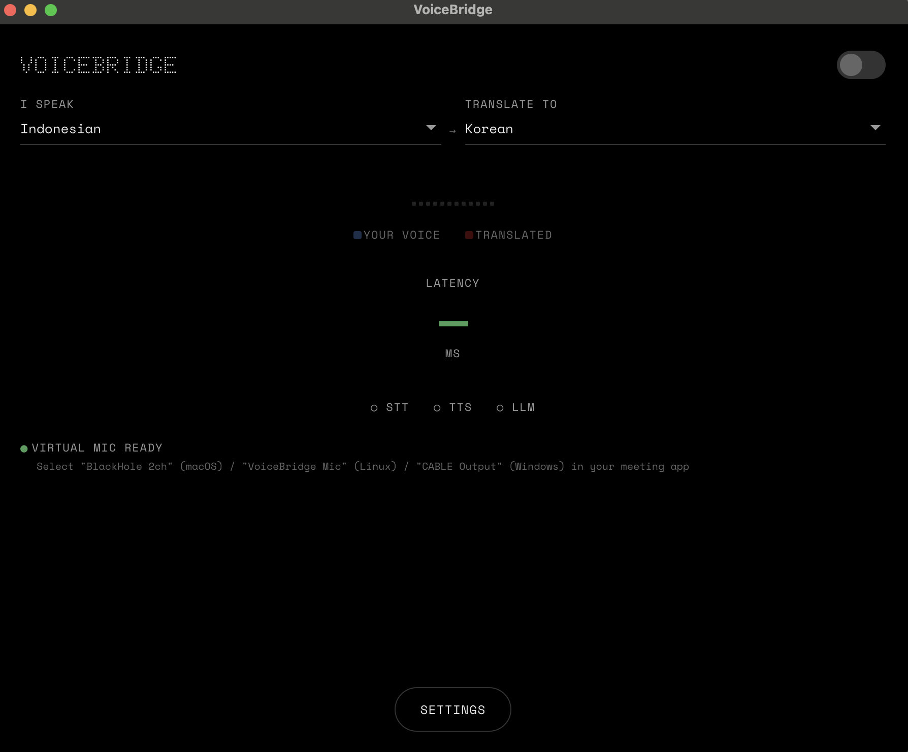
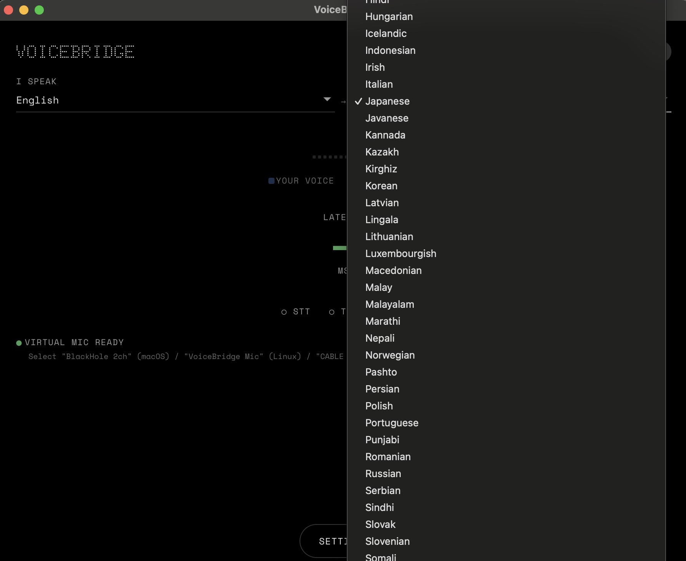
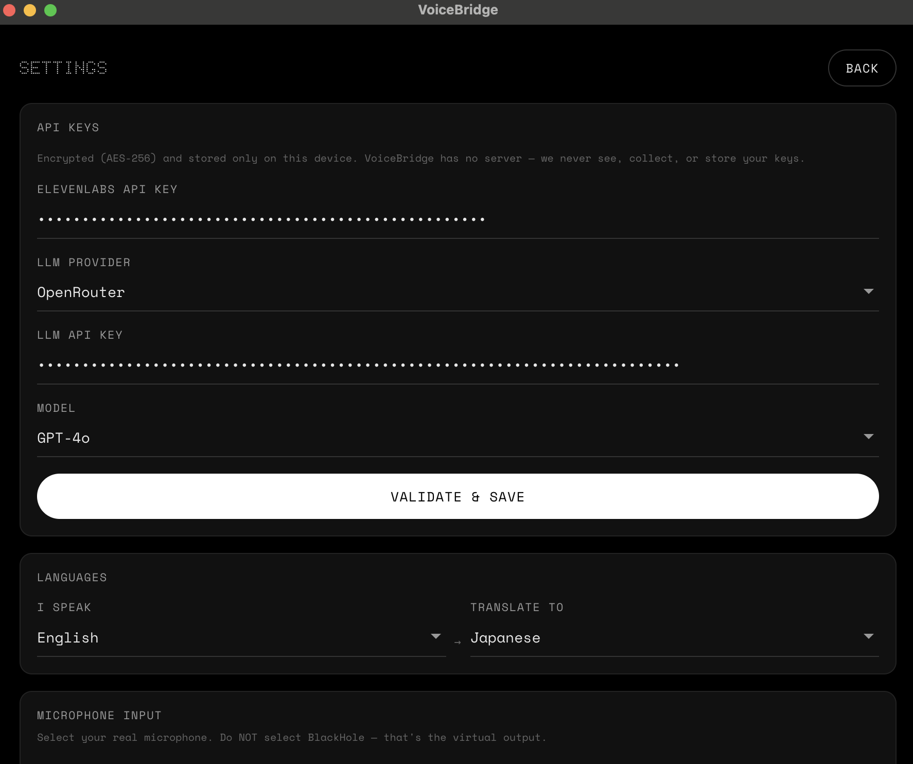
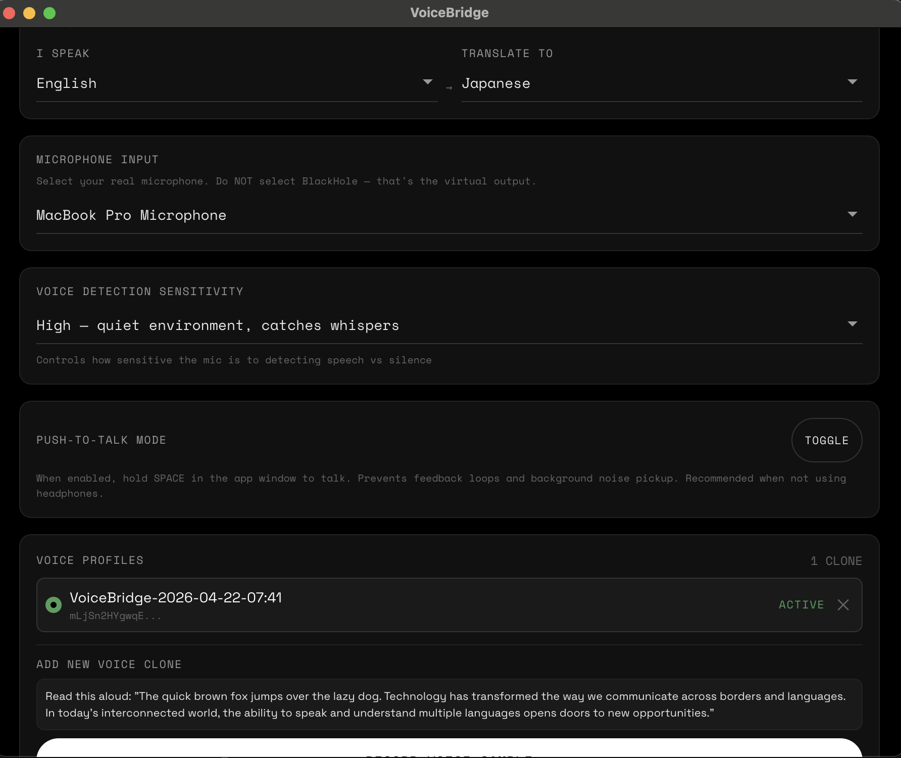

<p align="center">
  
</p>

<h1 align="center">VoiceBridge</h1>

<p align="center">
  <strong>Speak any language. In your own voice.</strong>
</p>

<p align="center">
  <em>Real-time voice translation with a virtual microphone — works in every meeting app.</em>
</p>

<p align="center">
  <a href="#quick-start">Quick Start</a> · <a href="docs/ARCHITECTURE.md">Architecture</a> · <a href="docs/GETTING-STARTED.md">Setup Guide</a> · <a href="docs/API-REFERENCE.md">API Reference</a>
</p>

---

<p align="center">
  <em>English → Japanese → Indonesian → Russian → Korean , real-time, in the speaker's own cloned voice.</em>
</p>

---

## Screenshots

<p align="center">
  
  
</p>
<p align="center">
  
  
</p>

---

## Demo

[https://github.com/user-attachments/assets/demo.mov
](https://github.com/user-attachments/assets/a6d14b28-c75f-4267-9a57-6776f1dd8cb2)

---

## One More Thing.

You're in a meeting with colleagues in Tokyo, clients in São Paulo, and partners in Berlin. You speak Indonesian. They hear you — fluently, naturally, instantly — in Japanese, Portuguese, and German. In *your* voice.

Not a robotic translation. Not a subtitle at the bottom of the screen. Not a five-second delay while some server thinks about it.

**You. Speaking their language. In real time. In your own voice.**

VoiceBridge captures your microphone, transcribes your speech, translates it through an LLM, clones your voice, and outputs the translated audio through a virtual microphone — so any meeting app hears the translated version. Other participants don't install anything. They don't configure anything. They just hear you, speaking their language, as if you always could.

---

## Prerequisites

| Requirement | macOS | Ubuntu/Linux | Windows |
|------------|-------|-------------|---------|
| Node.js 18+ | [nodejs.org](https://nodejs.org) | `sudo apt install nodejs npm` | [nodejs.org](https://nodejs.org) |
| ffmpeg | `brew install ffmpeg` | `sudo apt install ffmpeg` | [ffmpeg.org/download](https://ffmpeg.org/download.html) |
| Homebrew | [brew.sh](https://brew.sh) | — | — |
| PulseAudio/PipeWire | — | Pre-installed on Ubuntu 22.04+ | — |
| ElevenLabs API key | [elevenlabs.io](https://elevenlabs.io) | [elevenlabs.io](https://elevenlabs.io) | [elevenlabs.io](https://elevenlabs.io) |
| LLM API key | [openrouter.ai](https://openrouter.ai) / [openai.com](https://platform.openai.com) / [anthropic.com](https://console.anthropic.com) | same | same |

ffmpeg is required for real-time mic capture and virtual mic audio output. Without it, VoiceBridge falls back to a silent mock (no audio).

---

## The Pipeline

```
  ┌─────────┐    ┌───────────┐    ┌─────────────┐    ┌───────────┐    ┌──────────────┐
  │  Your    │───▶│ Transcribe│───▶│  Translate   │───▶│ Your Clone│───▶│  Virtual Mic │
  │  Voice   │    │  (Scribe) │    │   (LLM)      │    │  Voice    │    │  "VoiceBridge│
  │  16kHz   │    │  150ms    │    │   300ms      │    │  75ms     │    │   Mic"       │
  └─────────┘    └───────────┘    └─────────────┘    └───────────┘    └──────────────┘
```

Five stages. Under 1.5 seconds. Works everywhere.

| Stage | What Happens | Technology | Latency |
|-------|-------------|-----------|---------|
| Capture | Real mic audio captured via ffmpeg | avfoundation (macOS) / pulse (Linux) / dshow (Windows) | 10ms |
| Transcribe | Speech becomes text in real-time | ElevenLabs Scribe v2 Realtime | 150ms |
| Translate | Text translated token-by-token | OpenAI / Anthropic / OpenRouter | 300ms |
| Synthesize | Translated text becomes speech in your voice | ElevenLabs Flash v2.5 TTS | 75ms |
| Output | Translated audio written to virtual mic | ffmpeg → BlackHole / PulseAudio / VB-CABLE | 10ms |

---

## Architecture

```
┌──────────────────────────────────────────────────────┐
│                 Electron Desktop App                  │
│                                                      │
│  ┌─────────────────┐   ┌─────────────────────────┐  │
│  │  Main Process    │   │  Renderer (Preact)       │  │
│  │  Node.js + N-API │◄─►│  Nothing Design System   │  │
│  │                  │IPC│                           │  │
│  │  • Pipeline      │   │  • Main Window (360×480) │  │
│  │  • Audio Router  │   │  • System Tray           │  │
│  │  • Settings      │   │  • Settings View         │  │
│  │  • Driver Mgmt   │   │  • Debug Log             │  │
│  └────────┬─────────┘   └─────────────────────────┘  │
│           │                                           │
│  ┌────────▼─────────┐                                 │
│  │  Audio I/O        │                                 │
│  │  (ffmpeg)         │                                 │
│  │                    │                                 │
│  │  • Mic Capture     │                                 │
│  │  • Virtual Mic Out │                                 │
│  │  • Resampling      │                                 │
│  └────────┬───────────┘                                 │
└───────────┼─────────────────────────────────────────────┘
            │
┌───────────▼─────────────────────────────────────────────┐
│                    OS Audio Layer                        │
│                                                         │
│  ┌────────────┐   ┌─────────────────────┐               │
│  │ Real Mic    │   │ "VoiceBridge Mic"   │               │
│  │ (hardware)  │   │ (virtual driver)    │               │
│  └────────────┘   └──────────┬──────────┘               │
│                              │                           │
│                   ┌──────────▼──────────┐               │
│                   │  Any Meeting App     │               │
│                   │  Teams / Zoom / Meet │               │
│                   │  Discord / Slack     │               │
│                   └─────────────────────┘               │
└─────────────────────────────────────────────────────────┘
```

### Virtual Mic Driver (Per OS)

| OS | What Gets Installed | How |
|----|-------------------|-----|
| macOS | [BlackHole 2ch](https://existential.audio/blackhole/) | `brew install blackhole-2ch` |
| Ubuntu/Linux | PulseAudio/PipeWire null sink | `pactl load-module module-null-sink` |
| Windows | [VB-CABLE](https://vb-audio.com/Cable/) | Manual download + Run as Administrator |

---

## Features

### Real-Time Voice Translation
Speak naturally. Your words are transcribed, translated, and re-spoken in your cloned voice — all while you're still finishing your sentence.

### Push-to-Talk
Hold SPACE or the on-screen button to talk. Each press is an independent utterance — no accumulation, no feedback loops, no background noise pickup.

### Your Voice. Every Language.
Record 30 seconds. VoiceBridge clones your voice. Now you speak 90+ languages and it still sounds like you.

### Works With Everything
Teams. Zoom. Google Meet. Discord. Slack. FaceTime. WhatsApp. Any app that uses a microphone.

### Nothing Design Language
OLED blacks. Space Mono labels. Mechanical toggles. System tray app that stays out of your way.

---

## Quick Start

### 1. Install prerequisites

```bash
# macOS
brew install ffmpeg sox

# Ubuntu/Debian
sudo apt install ffmpeg sox

# Windows — download from https://ffmpeg.org/download.html
```

### 2. Clone and install

```bash
git clone https://github.com/AlleyBo55/VoiceBridge.git
cd VoiceBridge/desktop
npm install
```

### 3. Run

```bash
npm run dev
```

### 4. First launch

VoiceBridge walks you through setup:

1. **Prerequisites** — checks for ffmpeg, sox, and virtual mic driver. One-click install for each.
2. **API Keys** — enter your ElevenLabs key and LLM key. Keys are validated before saving.
3. **Voice Clone** — record 30+ seconds of your voice. Skip to use a default voice.

Keys are encrypted with AES-GCM-256 and stored only on your device. VoiceBridge has no server.

### 5. Use it

1. Open any meeting app → select "BlackHole 2ch" as your microphone
2. Toggle translation on in VoiceBridge
3. Hold SPACE and speak — other participants hear your translated voice

---

## 90+ Languages

**Input**: Every language ElevenLabs Scribe supports. Auto-detect is default.
**Output**: Every language ElevenLabs TTS supports. Any-to-any. No restrictions.

---

## Tech Stack

| Layer | Choice | Why |
|-------|--------|-----|
| App Shell | Electron | Cross-platform desktop, native addon support |
| UI | Preact + CSS Custom Properties | 3KB gzipped, Nothing design system |
| Audio I/O | ffmpeg | Real mic capture + virtual mic output |
| Virtual Mic | BlackHole / PulseAudio / VB-CABLE | OS-level virtual audio device |
| STT | ElevenLabs Scribe v2 Realtime | 150ms latency, 90+ languages |
| TTS | ElevenLabs Flash v2.5 | 75ms latency, voice cloning |
| Translation | OpenAI / Anthropic / OpenRouter | Streaming, 200+ models |
| Testing | Vitest + fast-check | Property-based correctness |

---

## Privacy

- Audio is streamed, never stored
- API keys encrypted with AES-GCM-256
- No analytics. No tracking. No telemetry.
- No embedded keys — the build ships empty
- Panic button (Ctrl/Cmd+Shift+X) kills everything instantly

---

## Keyboard Shortcuts

| Shortcut | Action |
|----------|--------|
| `Space` | Push-to-talk (hold to speak) |
| `Ctrl/Cmd+Shift+T` | Toggle translation |
| `Ctrl/Cmd+Shift+G` | Toggle Ghost Mode |
| `Ctrl/Cmd+Shift+X` | Panic stop |

---

## Development

```bash
cd desktop
npm install          # Install dependencies
npm run dev          # Build + launch Electron with hot-reload
npm run test         # Run 42 property-based tests
```

### Project Structure

```
desktop/
├── src/
│   ├── main/           # Electron main process
│   │   ├── main.ts             # Entry, tray, window, IPC
│   │   ├── desktop-pipeline.ts # Mic → STT → LLM → TTS → BlackHole
│   │   ├── audio-router.ts     # VAD, noise gate, routing
│   │   ├── driver-installer.ts # Virtual mic driver install
│   │   └── ...
│   ├── native/         # ffmpeg audio I/O
│   ├── preload/        # Security boundary
│   ├── renderer/       # Preact UI
│   └── shared/         # Types, platform utils
└── tests/properties/   # Property-based tests
```

---

## Built With Spec-Driven Development

This project was built using [Kiro](https://kiro.dev)'s spec-driven development — requirements → design → implementation, systematically.

### The Specs

**Phase 1 — Chrome Extension**
- [Requirements](.kiro/specs/voice-translate-chrome-extension/requirements.md) · [Design](.kiro/specs/voice-translate-chrome-extension/design.md) · [Tasks](.kiro/specs/voice-translate-chrome-extension/tasks.md)

**Phase 2 — Pipeline Hardening**
- [Requirements](.kiro/specs/pipeline-hardening/requirements.md) · [Design](.kiro/specs/pipeline-hardening/design.md) · [Tasks](.kiro/specs/pipeline-hardening/tasks.md)

**Phase 3 — Desktop App**
- [Requirements](.kiro/specs/desktop-app-rewrite/requirements.md) · [Design](.kiro/specs/desktop-app-rewrite/design.md) · [Tasks](.kiro/specs/desktop-app-rewrite/tasks.md)

---

## License

MIT — use it, fork it, ship it.

---

<p align="center">
  <br>
  <em>"The people who are crazy enough to think they can change the world are the ones who do."</em>
  <br><br>
  Built for <a href="https://hacks.elevenlabs.io/hackathons/4">ElevenLabs × Kiro Hackathon</a>
  <br>
  <a href="https://elevenlabs.io">ElevenLabs</a> · <a href="https://kiro.dev">Kiro</a> · <a href="https://hacks.elevenlabs.io/hackathons/4?sc_channel=sm&sc_publisher=TWITTER&sc_country=global&sc_geo=GLOBAL&sc_outcome=awareness">#ElevenHacks</a> · <a href="https://x.com/kirodotdev">#CodeWithKiro</a>
</p>
